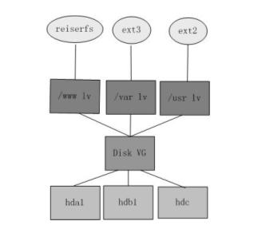

# 磁盘卷管理-VG LV PV

## 前言

每个Linux使用者在安装Linux时 都会遇到这样的困境：在为系统分区时，如何精确评估和分配各个硬盘分区的容量，因为系统管理员不但要考虑到当前某个分区需要的容量，还要预见该分区以后可能需要的容量的最大值。因为如果估计不准确，当遇到某个分区不够用时管理员可能甚至要备份整个系统、清除硬盘、重新对硬盘分区，然后恢复数据到新分区。

虽然现在有很多动态调整磁盘的工具可以使用，例如Partation Magic等等，但是它并不能完全解决问题，因为某个分区可能会再次被耗尽；另外一个方面这需要重新引导系统才能实现，对于很多关键的服务器，停机是不可接受的，而且对于添加新硬盘，希望一个能跨越多个硬盘驱动器的文件系统时，分区调整程序就不能解决问题。

因此完美的解决方法应该是在零停机前提下可以自如对文件系统的大小进行调整，可以方便实现文件系统跨越不同磁盘和分区。那么我们可以通过逻辑盘卷管理（LVM，Logical Volume Manager）的方式来非常完美的实现这一功能。

LVM是逻辑盘卷管理（Logical Volume Manager）的简称，他是磁盘管理的另一种工具，就目前基本上所有操作系统均支持，LVM是建立在硬盘和分区之上的一个逻辑层，来提高磁盘分区管理的灵活性。通过LVM系统管理员可以轻松管理磁盘分区，如：将若干个磁盘分区连接为一个整块的卷组（volume group），形成一个存储池。管理员可以在卷组上随意创建逻辑卷组（logical volumes），并进一步在逻辑卷组上创建文件系统。管理员通过LVM可以方便的调整存储卷组的大小，并且可以对磁盘存储按照组的方式进行命名、管理和分配，例如按照使用用途进行定义：“DBdata”和“DBSoft”，而不是使用物理磁盘名“sda”和“sdb”或”hda”和”hdb”。而且当系统添加了新的磁盘，通过LVM管理员就不必将磁盘的文件移动到新的磁盘上以充分利用新的存储空间，而是直接扩展文件系统跨越磁盘即可，架构可以参考如下图：

## 基本术语概念

前面谈到，LVM是在磁盘分区和文件系统之间添加的一个逻辑层，来为文件系统屏蔽下层磁盘分区布局，提供一个抽象的盘卷，在盘卷上建立文件系统。首先我们讨论以下几个LVM术语：

物理存储介质（The physical media）

这里指系统的存储设备：硬盘，如：/dev/hda、/dev/sda等等，是存储系统最低层的存储单元。

### 物理卷（physicalvolume）

物理卷就是指硬盘分区或从逻辑上与磁盘分区具有同样功能的设备(如RAID)，是LVM的基本存储逻辑块，但和基本的物理存储介质（如分区、磁盘等）比较，却包含有与LVM相关的管理参数。

### 卷组（Volume Group）

LVM卷组类似于非LVM系统中的物理硬盘，其由物理卷组成。可以在卷组上创建一个或多个“LVM分区”（逻辑卷），LVM卷组由一个或多个物理卷组成。

### 逻辑卷（logicalvolume）

LVM的逻辑卷类似于非LVM系统中的硬盘分区，在逻辑卷之上可以建立文件系统(比如/home或者/usr等)。

### PE（physical extent）

每一个物理卷被划分为称为PE(Physical Extents)的基本单元，具有唯一编号的PE是可以被LVM寻址的最小单元。PE的大小是可配置的，默认为4MB。

### LE（logical extent）

逻辑卷也被划分为被称为LE(Logical Extents) 的可被寻址的基本单位。在同一个卷组中，LE的大小和PE是相同的，并且一一对应。

首先可以看到，物理卷（PV）被由大小等同的基本单元PE组成。

一个卷组由一个或多个物理卷组成：

从上图可以看到，PE和LE有着一一对应的关系。逻辑卷建立在卷组上。逻辑卷就相当于非LVM系统的磁盘分区，可以在其上创建文件系统。

下图是磁盘分区、卷组、逻辑卷和文件系统之间的逻辑关系的示意图：

和非LVM系统将包含分区信息的元数据保存在位于分区的起始位置的分区表中一样，逻辑卷以及卷组相关的元数据也是保存在位于物理卷起始处的VGDA(卷组描述符区域)中。VGDA包括以下内容： PV描述符、VG描述符、LV描述符、和一些PE描述符 。

系统启动LVM时激活VG，并将VGDA加载至内存，来识别LV的实际物理存储位置。当系统进行I/O操作时，就会根据VGDA建立的映射机制来访问实际的物理位置。