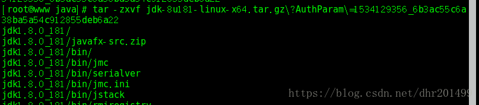

# jdk安装说明

## 在user目录下新建java文件夹

```cmd
# cd /usr/
# mkdir java
# cd java
```

## 下载jdk

进入 http://www.oracle.com/technetwork/java/javase/downloads/jdk8-downloads-2133151.html

```cmd
# wget http://download.oracle.com/otn-pub/java/jdk/8u181-b13/96a7b8442fe848ef90c96a2fad6ed6d1/jdk-8u181-linux-x64.tar.gz?AuthParam=1534129356_6b3ac55c6a38ba5a54c912855deb6a22
```

## 解压：使用tar -zxvf 文件名进行解压。



## 配置环境变量

```cmd
# vi /etc/profile
```

在最后面增加内容

```
export JAVA_HOME=/usr/java/jdk1.8.0_181
export PATH=$JAVA_HOME/bin:$PATH
export CLASSPATH=.:$JAVA_HOME/lib/dt.jar:$JAVA_HOME/lib
```

