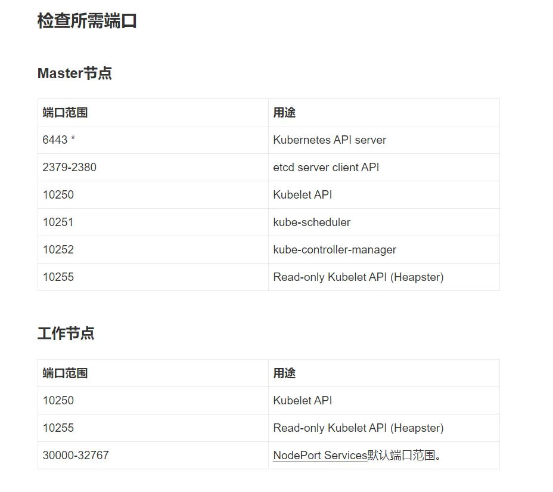

#  kubernetes集群

## 部署主机 

### 主机环境

| 软硬件            | 最低配置                                                     | 推荐配置                |
| ----------------- | ------------------------------------------------------------ | ----------------------- |
| **CPU和内存**     | Master: 至少2 Core和4G内存Node：至少4 Core和16G内存          | Master：4 core和16G内存 |
| **Linux操作系统** | 基于x86_64架构的各种Linux发行版本，Kernel版本要求在3.10及以上 | Red Hat Linux 7CentOS 7 |

 说明：

　　以上为建议配置，实际安装过程中，Master必须2 core 及以上（否则安装失败，切记），Node可以采用1 core。

## 环境准备

### 关闭防火墙

CentOS Linux 7 默认开起来防火墙服务（firewalld），而Kubernetes的Master与工作Node之间会有大量的网络通信，安全的做法是在防火墙上配置Kbernetes各组件（api-server、kubelet等等）需要相互通信的端口号。在安全的内部网络环境中可以关闭防火墙服务。

关闭防火墙的命令：
```
firewall-cmd --state           #查看防火墙状态
systemctl stop firewalld.service        #停止firewall
systemctl disable firewalld.service     #禁止firewall开机启动
```

如果你不想关闭防火墙，请把以下端口开放（在防火墙开放以下端口）



### 关闭SELinux

建议禁用SELinux，让容器可以读取主机文件系统

执行命令：

```
getenforce        #查看selinux状态
setenforce 0       #临时关闭selinux
sed -i 's/^ *SELINUX=enforcing/SELINUX=disabled/g' /etc/selinux/config  #永久关闭（需重启系统）
shutdown -r now   #重启系统(非必须)
```

### ntp时钟同步

参照[ntp时钟同步](../常用技巧及配置/ntp时钟同步.md)

### 禁用swap

Kubeadm建议关闭交换空间的使用，否则有可能会出现错误：```Error swap: running with swap on is not supported.please disable swap```

简单来说，执行swapoff -a命令，然后在/etc/fstab中删除对swap的加载，并重新启动服务器即可。

临时禁用，执行以下命令：

```shell
swapoff -a
```

永久禁用，需要在swapoff -a之后，执行以下命令：

```
sed -i.bak '/swap/s/^/#/' /etc/fstab
```

### 配置主机名

 Master主机改为master01，执行以下命令：

```shell
hostnamectl set-hostname master01 #修改主机名称为master01
more /etc/hostname  #查看修改结果
```

所有节点的主机都使用同样的方法进行修改

### 修改hosts文件

```shell
cat >> /etc/hosts << EOF
192.168.0.6     master01
192.168.0.10   node01
192.168.0.12   node02
EOF
```

### 允许 iptables 检查桥接流量

```
cat <<EOF | sudo tee /etc/modules-load.d/k8s.conf
br_netfilter
EOF

cat > /etc/sysctl.d/k8s.conf << EOF
net.bridge.bridge-nf-call-ip6tables = 1
net.bridge.bridge-nf-call-iptables = 1
EOF
```

```
sysctl --system
```

## 安装软件

### 安装docker-ce

```shell
yum -y install docker-ce
```

启动

```shell
systemctl start docker #启动服务
systemctl enable docker #设置开机启动
```

编辑docker配置文件/etc/docker/daemon.json

```json
{
 "exec-opts":["native.cgroupdriver=systemd"]
}
```

重启docker

### 安装kubelet kubeadm kubectl

```shell
yum install -y kubelet kubeadm kubectl
```

启动

```shell
systemctl enable kubelet #设置开机启动
```

## 主节点创建集群

#### 在master节点执行docker镜像导入

```shell
docker load -i images.tar ---加载镜像文件

docker images ---找到导入的镜像，查看镜像的id，名称和tag
```

如果如下则成功：

```shell
[root@master01 opt]# docker images
REPOSITORY                           TAG        IMAGE ID       CREATED        SIZE
k8s.gcr.io/kube-apiserver            v1.21.0    4d217480042e   2 weeks ago    126MB
k8s.gcr.io/kube-proxy                v1.21.0    38ddd85fe90e   2 weeks ago    122MB
k8s.gcr.io/kube-scheduler            v1.21.0    62ad3129eca8   2 weeks ago    50.6MB
k8s.gcr.io/kube-controller-manager   v1.21.0    09708983cc37   2 weeks ago    120MB
k8s.gcr.io/pause                     3.4.1      0f8457a4c2ec   3 months ago   683kB
k8s.gcr.io/coredns/coredns           v1.8.0     296a6d5035e2   6 months ago   42.5MB
k8s.gcr.io/etcd                      3.4.13-0   0369cf4303ff   8 months ago   253MB
```

#### 执行创建命令：

```shell
kubeadm init \
  --apiserver-advertise-address=172.27.134.248 \
  --pod-network-cidr=10.244.0.0/16
```

--apiserver-advertise-address 指明用 Master 的哪个 interface 与 Cluster 的其他节点通信

--pod-network-cidr 指定 Pod 网络的范围，Kubernetes 支持多种网络方案，而且不同网络方案对--pod-network-cidr 有自己的要求，这里设置为 10.244.0.0/16 是因为我们将使用 flannel 网络方案，必须设置成这个 CIDR

当出现如下结果，则安装成功:

```shell
[init] Using Kubernetes version: v1.21.0
[preflight] Running pre-flight checks
[preflight] Pulling images required for setting up a Kubernetes cluster
[preflight] This might take a minute or two, depending on the speed of your internet connection
[preflight] You can also perform this action in beforehand using 'kubeadm config images pull'
[certs] Using certificateDir folder "/etc/kubernetes/pki"
[certs] Generating "ca" certificate and key
[certs] Generating "apiserver" certificate and key
[certs] apiserver serving cert is signed for DNS names [kubernetes kubernetes.default kubernetes.default.svc kubernetes.default.svc.cluster.local master01] and IPs [168.1.0.1 172.27.134.248]
[certs] Generating "apiserver-kubelet-client" certificate and key
[certs] Generating "front-proxy-ca" certificate and key
[certs] Generating "front-proxy-client" certificate and key
[certs] Generating "etcd/ca" certificate and key
[certs] Generating "etcd/server" certificate and key
[certs] etcd/server serving cert is signed for DNS names [localhost master01] and IPs [172.27.134.248 127.0.0.1 ::1]
[certs] Generating "etcd/peer" certificate and key
[certs] etcd/peer serving cert is signed for DNS names [localhost master01] and IPs [172.27.134.248 127.0.0.1 ::1]
[certs] Generating "etcd/healthcheck-client" certificate and key
[certs] Generating "apiserver-etcd-client" certificate and key
[certs] Generating "sa" key and public key
[kubeconfig] Using kubeconfig folder "/etc/kubernetes"
[kubeconfig] Writing "admin.conf" kubeconfig file
[kubeconfig] Writing "kubelet.conf" kubeconfig file
[kubeconfig] Writing "controller-manager.conf" kubeconfig file
[kubeconfig] Writing "scheduler.conf" kubeconfig file
[kubelet-start] Writing kubelet environment file with flags to file "/var/lib/kubelet/kubeadm-flags.env"
[kubelet-start] Writing kubelet configuration to file "/var/lib/kubelet/config.yaml"
[kubelet-start] Starting the kubelet
[control-plane] Using manifest folder "/etc/kubernetes/manifests"
[control-plane] Creating static Pod manifest for "kube-apiserver"
[control-plane] Creating static Pod manifest for "kube-controller-manager"
[control-plane] Creating static Pod manifest for "kube-scheduler"
[etcd] Creating static Pod manifest for local etcd in "/etc/kubernetes/manifests"
[wait-control-plane] Waiting for the kubelet to boot up the control plane as static Pods from directory "/etc/kubernetes/manifests". This can take up to 4m0s
[kubelet-check] Initial timeout of 40s passed.
[apiclient] All control plane components are healthy after 61.502169 seconds
[upload-config] Storing the configuration used in ConfigMap "kubeadm-config" in the "kube-system" Namespace
[kubelet] Creating a ConfigMap "kubelet-config-1.21" in namespace kube-system with the configuration for the kubelets in the cluster
[upload-certs] Skipping phase. Please see --upload-certs
[mark-control-plane] Marking the node master01 as control-plane by adding the labels: [node-role.kubernetes.io/master(deprecated) node-role.kubernetes.io/control-plane node.kubernetes.io/exclude-from-external-load-balancers]
[mark-control-plane] Marking the node master01 as control-plane by adding the taints [node-role.kubernetes.io/master:NoSchedule]
[bootstrap-token] Using token: jplcr2.57m5zi3uf4md2z6y
[bootstrap-token] Configuring bootstrap tokens, cluster-info ConfigMap, RBAC Roles
[bootstrap-token] configured RBAC rules to allow Node Bootstrap tokens to get nodes
[bootstrap-token] configured RBAC rules to allow Node Bootstrap tokens to post CSRs in order for nodes to get long term certificate credentials
[bootstrap-token] configured RBAC rules to allow the csrapprover controller automatically approve CSRs from a Node Bootstrap Token
[bootstrap-token] configured RBAC rules to allow certificate rotation for all node client certificates in the cluster
[bootstrap-token] Creating the "cluster-info" ConfigMap in the "kube-public" namespace
[kubelet-finalize] Updating "/etc/kubernetes/kubelet.conf" to point to a rotatable kubelet client certificate and key
[addons] Applied essential addon: CoreDNS
[addons] Applied essential addon: kube-proxy

Your Kubernetes control-plane has initialized successfully!

To start using your cluster, you need to run the following as a regular user:

  mkdir -p $HOME/.kube
  sudo cp -i /etc/kubernetes/admin.conf $HOME/.kube/config
  sudo chown $(id -u):$(id -g) $HOME/.kube/config

Alternatively, if you are the root user, you can run:

  export KUBECONFIG=/etc/kubernetes/admin.conf

You should now deploy a pod network to the cluster.
Run "kubectl apply -f [podnetwork].yaml" with one of the options listed at:
  https://kubernetes.io/docs/concepts/cluster-administration/addons/

Then you can join any number of worker nodes by running the following on each as root:

kubeadm join 172.27.134.248:6443 --token jplcr2.57m5zi3uf4md2z6y \
	--discovery-token-ca-cert-hash sha256:7a65c1b205fda462d72492b44275c6f1845457727d7a4ea6f044ee646744f81c
```

#### 配置kubectl

要使非 root 用户可以运行 kubectl，请运行以下命令

```shell
mkdir -p $HOME/.kube
sudo cp -i /etc/kubernetes/admin.conf $HOME/.kube/config
sudo chown $(id -u):$(id -g) $HOME/.kube/config
```

或者，如果你是 `root` 用户，则可以运行：

```shell
export KUBECONFIG=/etc/kubernetes/admin.conf
```

#### 安装 Pod 网络

要让 Kubernetes Cluster 能够工作，必须安装 Pod 网络，否则 Pod 之间无法通信。Kubernetes 支持多种网络方案，这里我们使用 flannel。

导入flannel的docker镜像

```shell
docker load < flanneld-v0.14.0-rc1-amd64.docker
```

执行安装

```shell
kubectl apply -f kube-flannel.yml
```

执行成功后：

```shell
[root@master01 opt]# kubectl apply -f kube-flannel.yml
Warning: policy/v1beta1 PodSecurityPolicy is deprecated in v1.21+, unavailable in v1.25+
podsecuritypolicy.policy/psp.flannel.unprivileged created
clusterrole.rbac.authorization.k8s.io/flannel created
clusterrolebinding.rbac.authorization.k8s.io/flannel created
serviceaccount/flannel created
configmap/kube-flannel-cfg created
daemonset.apps/kube-flannel-ds created
```

验证下是否成功：

```shell
kubectl get nodes
[root@master01 opt]# kubectl get nodes
NAME       STATUS   ROLES                  AGE   VERSION
master01   Ready    control-plane,master   16h   v1.21.0
```

当节点STATUS变为ready则安装成功

### 子节点加入集群

在其他服务器上面执行向集群添加新节点，执行在kubeadm init输出的kubeadm join命令：

```shell
kubeadm join一行是master端 kubeadm init 生成的,实际你的会变化
# kubeadm join 192.168.153.34:6443 --token 6qf11n.pdyzp2zki1ydb2fc \
    --discovery-token-ca-cert-hash sha256:e9055d8b3cfcf40330124f5da18e820ebcb6eb9ff28eb64c0f593e0fb154b755 
```

如果token失效或是忘记，可以在主节点主机上执行

```shell
kubeadm token create
```

重新创建token

拓展：

> 创建集群的时候，会拉取镜像，查看需要拉取的镜像命令：
>
> ```shell
> [root@master01 ~]# kubeadm config images list
> k8s.gcr.io/kube-apiserver:v1.21.0
> k8s.gcr.io/kube-controller-manager:v1.21.0
> k8s.gcr.io/kube-scheduler:v1.21.0
> k8s.gcr.io/kube-proxy:v1.21.0
> k8s.gcr.io/pause:3.4.1
> k8s.gcr.io/etcd:3.4.13-0
> k8s.gcr.io/coredns/coredns:v1.8.0
> ```
>
> 可以提取拉取对应镜像，并且通过--image-repository指定私服，google并没有将kubernetes的镜像放到docker hub上。所以，我们需要先使用脚本，从阿里云的google_containers命名空间下载对应的克隆镜像，然后再通过docker tag将其labels修改为kubeadm生成的static-pod yaml文件对应的镜像标签。从而欺骗kubeadm，所有镜像都已经ready了，不用再去公网上拉取了。
>
> pull.sh脚本:
>
> ```shell
> for i in `kubeadm config images list`; do 
>   imageName=${i#k8s.gcr.io/}
>   docker pull registry.aliyuncs.com/google_containers/$imageName
>   docker tag registry.aliyuncs.com/google_containers/$imageName k8s.gcr.io/$imageName
>   docker rmi registry.aliyuncs.com/google_containers/$imageName
> done;
> ```


