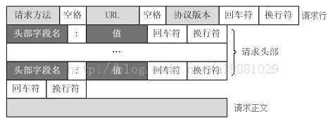
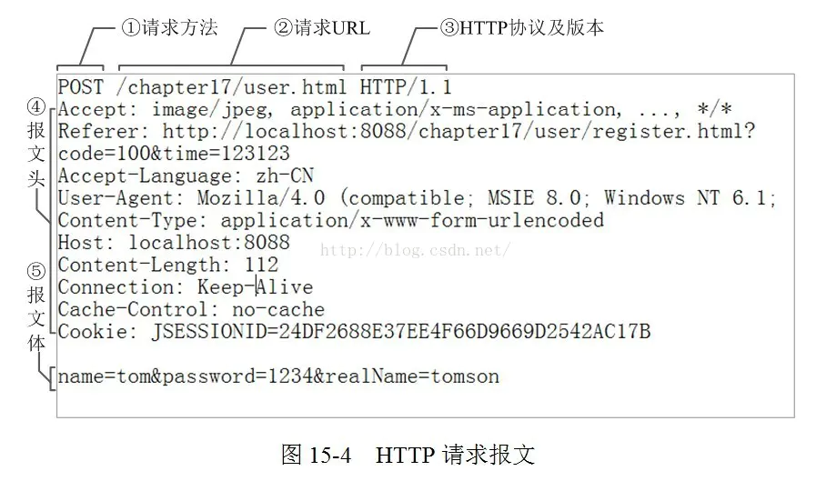
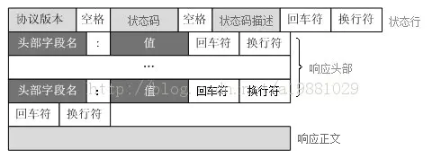
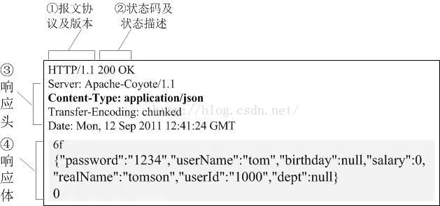

# Http说明

## HTTP请求、响应报文格式

要弄明白网络框架，首先需要先掌握Http请求的，响应的报文格式。

### HTTP请求报文格式:

TTP请求报文主要由**请求行**、**请求头部**、**请求正文**3部分组成.



#### 1.请求行:

由请求方法，URL，协议版本三部分构成，之间用空格隔开

请求方法包括：POST、GET、HEAD、PUT、POST、TRACE、OPTIONS、DELETE等

协议版本：HTTP/主版本号.次版本号，常用的有HTTP/1.0和HTTP/1.1

#### 2.请求头部:

请求头部为请求报文添加了一些附加信息，由“名/值”对组成，每行一对，名和值之间使用冒号分隔
常见请求头如下：
- Host ----接受请求的服务器地址，可以是IP:端口号，也可以是域名
- User-Agent ----发送请求的应用程序名称
- Connection ---- 指定与连接相关的属性，如Connection:Keep-Alive
- Accept-Charset ---- 通知服务端可以发送的编码格式
- Accept-Encoding ---- 通知服务端可以发送的数据压缩格式
- Accept-Language ---- 通知服务端可以发送的语言
- Content-Type ---- 请求的类型

#### 3.请求正文:

可选部分，比如GET请求就没有请求正文

#### 4.请求示例:



### HTTP响应报文格式:

HTTP响应报文主要由**状态行**、**响应头部**、**响应正文**3部分组成



#### 1.状态行：

由3部分组成，分别为：**协议版本**，**状态码**，**状态码描述**，之间由空格分隔
状态码:为3位数字，200-299的状态码表示成功，300-399的状态码指资源重定向，400-499的状态码指客户端请求出错，500-599的状态码指服务端出错（HTTP/1.1向协议中引入了信息性状态码，范围为100-199)
常见的：
200：响应成功
302：重定向跳转，跳转地址通过响应头中的Location属性指定
400：客户端请求有语法错误，参数错误，不能被服务器识别
403：服务器接收到请求，但是拒绝提供服务（认证失败）
404：请求资源不存在
500：服务器内部错误

| 状态码 | 状态码英文名称 | 中文描述 |
| :----:| :----: | :----: |
|100|Continue|继续。客户端应继续其请求|
|101|Switching Protocols|切换协议。服务器根据客户端的请求切换协议。只能切换到更高级的协议，例如，切换到HTTP的新版本协议|
|200|OK|请求成功。一般用于GET与POST请求|
|201|Created|已创建。成功请求并创建了新的资源|
|202|Accepted|已接受。已经接受请求，但未处理完成|
|203|Non-Authoritative Information|非授权信息。请求成功。但返回的meta信息不在原始的服务器，而是一个副本|
|204|No Content|无内容。服务器成功处理，但未返回内容。在未更新网页的情况下，可确保浏览器继续显示当前文档|
|205|Reset Content|重置内容。服务器处理成功，用户终端（例如：浏览器）应重置文档视图。可通过此返回码清除浏览器的表单域|
|206|Partial Content|部分内容。服务器成功处理了部分GET请求|
|300|Multiple Choices|多种选择。请求的资源可包括多个位置，相应可返回一个资源特征与地址的列表用于用户终端（例如：浏览器）选择|
|301|Moved Permanently|永久移动。请求的资源已被永久的移动到新URI，返回信息会包括新的URI，浏览器会自动定向到新URI。今后任何新的请求都应使用新的URI代替|
|302|Found|临时移动。与301类似。但资源只是临时被移动。客户端应继续使用原有URI|
|303|See Other|查看其它地址。与301类似。使用GET和POST请求查看|
|304|Not Modified|未修改。所请求的资源未修改，服务器返回此状态码时，不会返回任何资源。客户端通常会缓存访问过的资源，通过提供一个头信息指出客户端希望只返回在指定日期之后修改的资源|
|305|Use Proxy|使用代理。所请求的资源必须通过代理访问|
|306|Unused|已经被废弃的HTTP状态码|
|307|Temporary Redirect|临时重定向。与302类似。使用GET请求重定向|
|400|Bad Request|客户端请求的语法错误，服务器无法理解|
|401|Unauthorized|请求要求用户的身份认证|
|402|Payment Required|保留，将来使用|
|403|Forbidden|服务器理解请求客户端的请求，但是拒绝执行此请求|
|404|Not Found|服务器无法根据客户端的请求找到资源（网页）。通过此代码，网站设计人员可设置"您所请求的资源无法找到"的个性页面|
|405|Method Not Allowed|客户端请求中的方法被禁止|
|406|Not Acceptable|服务器无法根据客户端请求的内容特性完成请求|
|407|Proxy Authentication Required|请求要求代理的身份认证，与401类似，但请求者应当使用代理进行授权|
|408|Request Time-out|服务器等待客户端发送的请求时间过长，超时|
|409|Conflict|服务器完成客户端的 PUT 请求时可能返回此代码，服务器处理请求时发生了冲突|
|410|Gone|客户端请求的资源已经不存在。410不同于404，如果资源以前有现在被永久删除了可使用410代码，网站设计人员可通过301代码指定资源的新位置|
|411|Length Required|服务器无法处理客户端发送的不带Content-Length的请求信息|
|412|Precondition Failed|客户端请求信息的先决条件错误|
|413|Request Entity Too Large|由于请求的实体过大，服务器无法处理，因此拒绝请求。为防止客户端的连续请求，服务器可能会关闭连接。如果只是服务器暂时无法处理，则会包含一个Retry-After的响应信息|
|414|Request-URI Too Large|请求的URI过长（URI通常为网址），服务器无法处理|
|415|Unsupported Media Type|服务器无法处理请求附带的媒体格式|
|416|Requested range not satisfiable|客户端请求的范围无效|
|417|Expectation Failed|服务器无法满足Expect的请求头信息|
|500|Internal Server Error|服务器内部错误，无法完成请求|
|501|Not Implemented|服务器不支持请求的功能，无法完成请求|
|502|Bad Gateway|作为网关或者代理工作的服务器尝试执行请求时，从远程服务器接收到了一个无效的响应|
|503|Service Unavailable|由于超载或系统维护，服务器暂时的无法处理客户端的请求。延时的长度可包含在服务器的Retry-After头信息中|
|504|Gateway Time-out|充当网关或代理的服务器，未及时从远端服务器获取请求|
|505|HTTP Version not supported|服务器不支持请求的HTTP协议的版本，无法完成处理|

#### 2.响应头部:

与请求头部类似，为响应报文添加了一些附加信息
Server - 服务器应用程序软件的名称和版本
Content-Type - 响应正文的类型（是图片还是二进制字符串）
Content-Length - 响应正文长度
Content-Charset - 响应正文使用的编码
Content-Encoding - 响应正文使用的数据压缩格式
Content-Language - 响应正文使用的语言
Content-Type - 请求的类型
```
Server: bfe/1.0.8.1 
Date: Sat, 04 Apr 2015 02:49:41 GMT 
Content-Type: text/html; charset=utf-8 
Vary: Accept-Encoding 
Cache-Control: private 
cxy_all: baidu+8ee3da625d74d1aa1ac9a7c34a2191dc 
Expires: Sat, 04 Apr 2015 02:49:38 GMT 
X-Powered-By: HPHP 
bdpagetype: 1 
bdqid: 0xb4eababa0002db6e 
bduserid: 0 
Set-Cookie: BDSVRTM=0; path=/ 
BD_HOME=0; path=/ 
H_PS_PSSID=13165_12942_1430_13075_12867_13322_12691_13348_12723_12797_13309_13325_13203_13161_13256_8498; path=/; domain=.baidu.com 
__bsi=18221750326646863206_31_0_I_R_2_0303_C02F_N_I_I; expires=Sat, 04-Apr-15 02:49:46 GMT; domain=www.baidu.com; path=/ 
Content-Encoding: gzip 
X-Firefox-Spdy: 3.1
```

#### 3.响应正文:

是请求响应的最终结果，都在响应体里。
报文可以承载很多类型的数字数据：图片、视频、HTML文档、软件应用程序等

#### 4.响应示例:




### Http请求中Content-Type

客户端在进行http请求服务器的时候，需要告诉服务器请求的类型，服务器在返回给客户端的数据的时候，也需要告诉客户端返回数据的类型

默认的ContentType为 text/html 也就是网页格式. 常用的内容类型

- text/plain ：纯文本格式 .txt
- text/xml ： XML格式 .xml
- image/gif ：gif图片格式 .gif
- image/jpeg ：jpg图片格式 .jpg
- image/png：png图片格式 .png
- audio/mp3 : 音频mp3格式 .mp3
- audio/rn-mpeg :音频mpga格式 .mpga
- video/mpeg4 : 视频mp4格式 .mp4
- video/x-mpg : 视频mpa格式 .mpg
- video/x-mpeg :视频mpeg格式 .mpeg
- video/mpg : 视频mpg格式 .mpg
- 以application开头的媒体格式类型：
- application/xhtml+xml ：XHTML格式
- application/xml ： XML数据格式
- application/atom+xml ：Atom XML聚合格式
- application/json ： JSON数据格式
- application/pdf ：pdf格式
- application/msword ： Word文档格式
- application/octet-stream ： 二进制流数据（如常见的文件下载）
