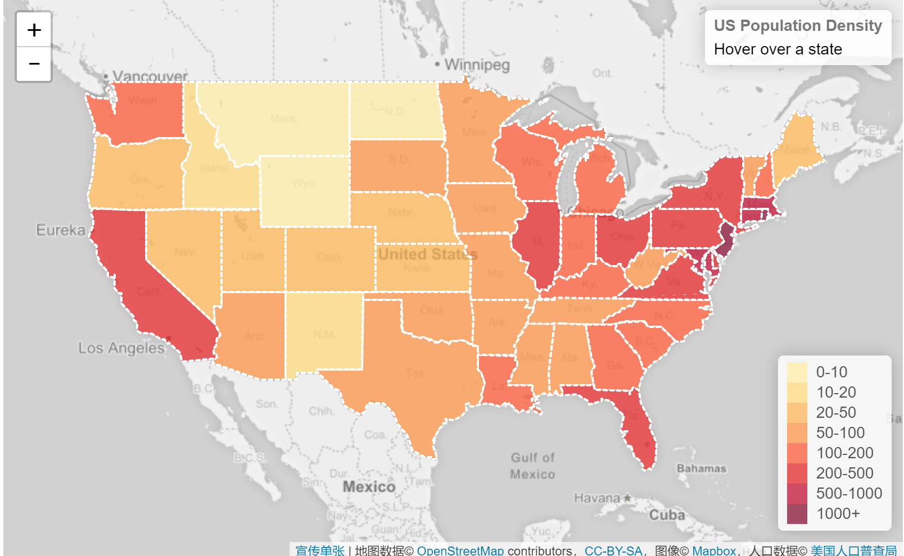
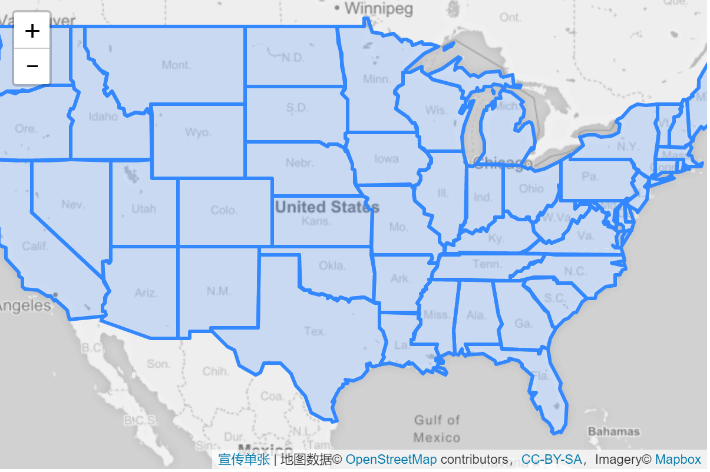
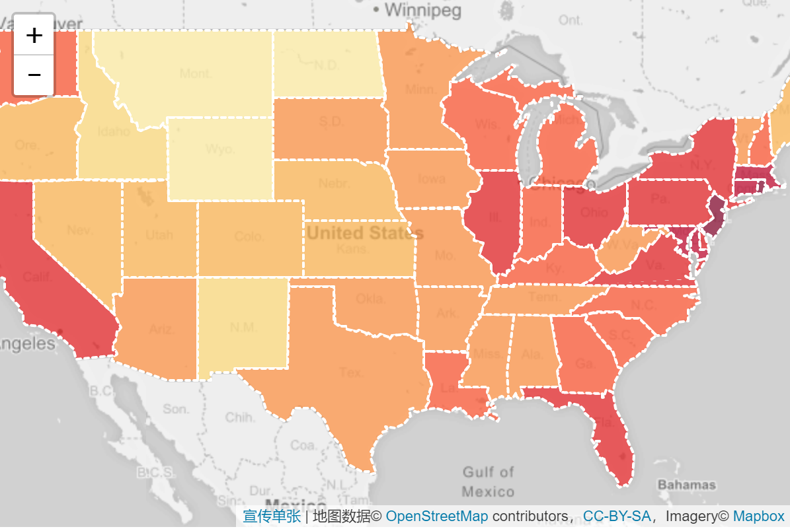

# 交互式等值线图



## 数据源

我们将创建每个美国州人口密度的可视化。由于数据量（状态形状和每个状态的密度值）不是很大，因此存储然后显示它的最方便和最简单的方法是GeoJSON。

我们的GeoJSON数据（[us-states.js](../../data/us-states.js)）的每个功能都如下所示：

```
{
    "type": "Feature",
    "properties": {
        "name": "Alabama",
        "density": 94.65
    },
    "geometry": ...
    ...
}
```

## 底图

设置Mapbox作为地图的底图：

```
var mapboxAccessToken = {your access token here};
var map = L.map('map').setView([37.8, -96], 4);

L.tileLayer('https://api.tiles.mapbox.com/v4/{id}/{z}/{x}/{y}.png?access_token=' + mapboxAccessToken, {
    id: 'mapbox.light',
    attribution: ...
}).addTo(map);

L.geoJson(statesData).addTo(map);
```


## 添加一些颜色

现在我们需要根据人口密度为各州着色。使用我们从中获得的值，我们创建一个基于人口密度返回颜色的函数：

```js
function getColor(d) {
    return d > 1000 ? '#800026' :
           d > 500  ? '#BD0026' :
           d > 200  ? '#E31A1C' :
           d > 100  ? '#FC4E2A' :
           d > 50   ? '#FD8D3C' :
           d > 20   ? '#FEB24C' :
           d > 10   ? '#FED976' :
                      '#FFEDA0';
}
```

接下来，我们为GeoJSON图层定义样式函数，使其fillColor依赖于feature.properties.density属性，同时调整外观并添加带有虚线笔划的漂亮触感。

```js
function style(feature) {
    return {
        fillColor: getColor(feature.properties.density),
        weight: 2,
        opacity: 1,
        color: 'white',
        dashArray: '3',
        fillOpacity: 0.7
    };
}

L.geoJson(statesData, {style: style}).addTo(map);
```

现在看起来好多了！



## 添加交互

现在让我们用鼠标悬停时以某种方式直观地突出显示状态。首先，我们将为图层mouseover事件定义一个事件监听器：

```js
function highlightFeature(e) {
    var layer = e.target;

    layer.setStyle({
        weight: 5,
        color: '#666',
        dashArray: '',
        fillOpacity: 0.7
    });

    if (!L.Browser.ie && !L.Browser.opera && !L.Browser.edge) {
        layer.bringToFront();
    }
}
```

在这里，我们可以访问悬浮的图层，在图层上e.target设置一个粗灰色边框作为我们的高光效果，也将它带到前面，这样边框不会与附近的状态发生冲突（但不适用于IE，Opera或边缘，因为他们有这样做的问题bringToFront上mouseover）

接下来我们将定义发生的事情mouseout：

```js
function resetHighlight(e) {
    geojson.resetStyle(e.target);
}
```

方便的geojson.resetStyle方法会将图层样式重置为默认状态（由我们的style函数定义）。为此，请确保通过geojson变量访问我们的GeoJSON图层，方法是在我们的侦听器之前定义它并稍后将图层分配给它：

```
var geojson;
// ... our listeners
geojson = L.geoJson(...);
```

作为额外的触摸，让我们定义一个click缩放到状态的侦听器：

```js
function zoomToFeature(e) {
    map.fitBounds(e.target.getBounds());
}
```

现在我们将使用该onEachFeature选项在状态图层上添加侦听器：

```js
function onEachFeature(feature, layer) {
    layer.on({
        mouseover: highlightFeature,
        mouseout: resetHighlight,
        click: zoomToFeature
    });
}

geojson = L.geoJson(statesData, {
    style: style,
    onEachFeature: onEachFeature
}).addTo(map);
```

这使状态在悬停时很好地突出显示，并使我们能够在我们的侦听器中添加其他交互。

## 自定义信息控制

我们可以在点击时使用常用弹出窗口来显示有关不同状态的信息，但我们将选择不同的路线 - 在自定义控件内的状态悬停时显示它。

这是我们控制的代码：

```js
var info = L.control();

info.onAdd = function (map) {
    this._div = L.DomUtil.create('div', 'info'); // create a div with a class "info"
    this.update();
    return this._div;
};

// method that we will use to update the control based on feature properties passed
info.update = function (props) {
    this._div.innerHTML = '<h4>US Population Density</h4>' +  (props ?
        '<b>' + props.name + '</b><br />' + props.density + ' people / mi<sup>2</sup>'
        : 'Hover over a state');
};

info.addTo(map);
```

当用户将鼠标悬停在状态上时，我们需要更新控件，因此我们还将修改我们的侦听器，如下所示：

```
function highlightFeature(e) {
    ...
    info.update(layer.feature.properties);
}

function resetHighlight(e) {
    ...
    info.update();
}
```
该控件还需要一些CSS样式才能看起来不错：

```css
.info {
    padding: 6px 8px;
    font: 14px/16px Arial, Helvetica, sans-serif;
    background: white;
    background: rgba(255,255,255,0.8);
    box-shadow: 0 0 15px rgba(0,0,0,0.2);
    border-radius: 5px;
}
.info h4 {
    margin: 0 0 5px;
    color: #777;
}
```

## 自定义图例控件

使用图例创建控件更容易，因为它是静态的，并且在状态悬停时不会更改。JavaScript代码：

```js
var legend = L.control({position: 'bottomright'});

legend.onAdd = function (map) {

    var div = L.DomUtil.create('div', 'info legend'),
        grades = [0, 10, 20, 50, 100, 200, 500, 1000],
        labels = [];

    // loop through our density intervals and generate a label with a colored square for each interval
    for (var i = 0; i < grades.length; i++) {
        div.innerHTML +=
            '<i style="background:' + getColor(grades[i] + 1) + '"></i> ' +
            grades[i] + (grades[i + 1] ? '&ndash;' + grades[i + 1] + '<br>' : '+');
    }

    return div;
};

legend.addTo(map);
```

控件的CSS样式（我们也重用info前面定义的类）：

```css
.legend {
    line-height: 18px;
    color: #555;
}
.legend i {
    width: 18px;
    height: 18px;
    float: left;
    margin-right: 8px;
    opacity: 0.7;
}
```
