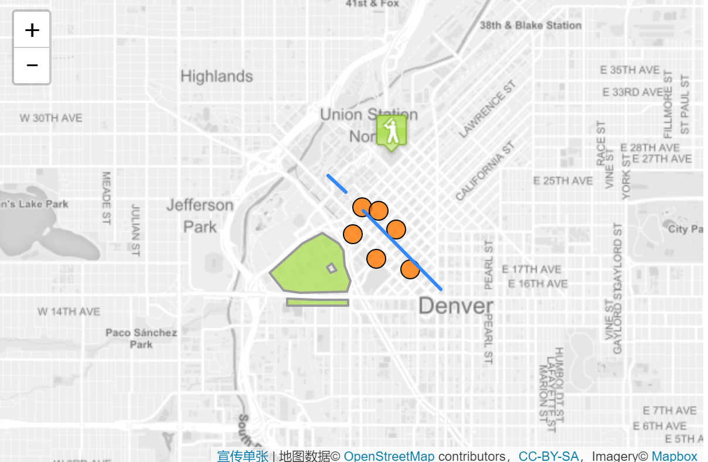

# 使用GeoJSON

## 将GeoJSON与Leaflet一起使用

GeoJSON正在成为许多GIS技术和服务中非常流行的数据格式 - 它简单，轻便，直观，而且Leaflet非常擅长处理它。在此示例中，您将学习如何创建与GeoJSON对象创建的地图向量并进行交互。



## 关于GeoJSON

GeoJSON是一种用于编码各种地理数据结构的格式。GeoJSON对象可以表示空间区域（几何），空间有界实体（要素）或要素列表（FeatureCollection）。GeoJSON支持以下几何类型：Point，LineString，Polygon，MultiPoint，MultiLineString，MultiPolygon和GeometryCollection。GeoJSON中的功能包含Geometry对象和其他属性，FeatureCollection包含功能列表。

Leaflet支持上述所有GeoJSON类型，但是最擅长Features和FeatureCollections，因为它们允许您使用一组属性描述功能。

我们甚至可以使用这些属性来设置Leaflet向量的样式。这是一个简单的GeoJSON功能的示例：

```js
var geojsonFeature = {
    "type": "Feature",
    "properties": {
        "name": "Coors Field",
        "amenity": "Baseball Stadium",
        "popupContent": "This is where the Rockies play!"
    },
    "geometry": {
        "type": "Point",
        "coordinates": [-104.99404, 39.75621]
    }
};
```

## GeoJSON层

GeoJSON对象通过GeoJSON层添加到地图中。要创建它并将其添加到地图，我们可以使用以下代码：

```js
L.geoJSON(geojsonFeature).addTo(map);
```

GeoJSON对象也可以作为有效GeoJSON对象的数组传递。

```js
var myLines = [{
    "type": "LineString",
    "coordinates": [[-100, 40], [-105, 45], [-110, 55]]
}, {
    "type": "LineString",
    "coordinates": [[-105, 40], [-110, 45], [-115, 55]]
}];
```
或者，我们可以创建一个空的GeoJSON图层并将其分配给变量，以便我们以后可以添加更多功能。

```js
var myLayer = L.geoJSON().addTo(map);
myLayer.addData(geojsonFeature);
```

## 选项

### 样式

该style选项可用于以两种不同方式设置样式。首先，我们可以传递一个简单的对象，它以相同的方式设置所有路径（折线和多边形）的样式：

```js
var myLines = [{
    "type": "LineString",
    "coordinates": [[-100, 40], [-105, 45], [-110, 55]]
}, {
    "type": "LineString",
    "coordinates": [[-105, 40], [-110, 45], [-115, 55]]
}];

var myStyle = {
    "color": "#ff7800",
    "weight": 5,
    "opacity": 0.65
};

L.geoJSON(myLines, {
    style: myStyle
}).addTo(map);
```

或者，我们可以传递一个函数，根据函数的属性设置各个函数的样式。在下面的示例中，我们检查“party”属性并相应地设置我们的多边形样式：

```js
var states = [{
    "type": "Feature",
    "properties": {"party": "Republican"},
    "geometry": {
        "type": "Polygon",
        "coordinates": [[
            [-104.05, 48.99],
            [-97.22,  48.98],
            [-96.58,  45.94],
            [-104.03, 45.94],
            [-104.05, 48.99]
        ]]
    }
}, {
    "type": "Feature",
    "properties": {"party": "Democrat"},
    "geometry": {
        "type": "Polygon",
        "coordinates": [[
            [-109.05, 41.00],
            [-102.06, 40.99],
            [-102.03, 36.99],
            [-109.04, 36.99],
            [-109.05, 41.00]
        ]]
    }
}];

L.geoJSON(states, {
    style: function(feature) {
        switch (feature.properties.party) {
            case 'Republican': return {color: "#ff0000"};
            case 'Democrat':   return {color: "#0000ff"};
        }
    }
}).addTo(map);

```

### pointToLayer

点的处理方式与折线和多边形不同。默认情况下，为GeoJSON点绘制简单标记。我们可以通过在创建GeoJSON图层时pointToLayer在GeoJSON选项对象中传递函数来改变这一点。此函数传递给LatLng并应返回ILayer的实例，在这种情况下可能是Marker或CircleMarker。

这里我们使用pointToLayer选项创建CircleMarker：

```js
var geojsonMarkerOptions = {
    radius: 8,
    fillColor: "#ff7800",
    color: "#000",
    weight: 1,
    opacity: 1,
    fillOpacity: 0.8
};

L.geoJSON(someGeojsonFeature, {
    pointToLayer: function (feature, latlng) {
        return L.circleMarker(latlng, geojsonMarkerOptions);
    }
}).addTo(map);
```

我们也可以style在这个例子中设置属性 - 如果你在pointToLayer函数内部创建一个像circle这样的矢量图层，Leaflet足够聪明，可以将样式应用于GeoJSON点。

### onEachFeature

该onEachFeature选项是在将每个要素添加到GeoJSON图层之前调用的功能。使用此选项的常见原因是在单击时为功能附加弹出窗口。

```js
function onEachFeature(feature, layer) {
    // does this feature have a property named popupContent?
    if (feature.properties && feature.properties.popupContent) {
        layer.bindPopup(feature.properties.popupContent);
    }
}

var geojsonFeature = {
    "type": "Feature",
    "properties": {
        "name": "Coors Field",
        "amenity": "Baseball Stadium",
        "popupContent": "This is where the Rockies play!"
    },
    "geometry": {
        "type": "Point",
        "coordinates": [-104.99404, 39.75621]
    }
};

L.geoJSON(geojsonFeature, {
    onEachFeature: onEachFeature
}).addTo(map);
```

### 过滤

该filter选项可用于控制GeoJSON功能的可见性。为此，我们传递一个函数作为filter选项。为GeoJSON图层中的每个要素调用此函数，并传递给feature和layer。然后，您可以使用要素属性中的值通过返回true或来控制可见性false。

在下面的示例中，“Busch Field”将不会显示在地图上。

```js
var someFeatures = [{
    "type": "Feature",
    "properties": {
        "name": "Coors Field",
        "show_on_map": true
    },
    "geometry": {
        "type": "Point",
        "coordinates": [-104.99404, 39.75621]
    }
}, {
    "type": "Feature",
    "properties": {
        "name": "Busch Field",
        "show_on_map": false
    },
    "geometry": {
        "type": "Point",
        "coordinates": [-104.98404, 39.74621]
    }
}];

L.geoJSON(someFeatures, {
    filter: function(feature, layer) {
        return feature.properties.show_on_map;
    }
}).addTo(map);
```

