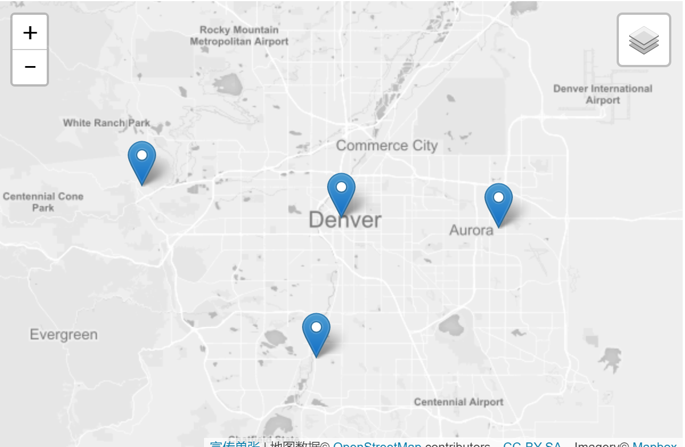

# 图层组和图层控件

本教程将向您展示如何将多个图层组合成一个图层，以及如何使用图层控件来允许用户轻松切换地图上的不同图层。



## 图层组

假设您有一堆要组合成一个组的图层，以便将它们作为代码中的一个处理：

```js
var littleton = L.marker([39.61, -105.02]).bindPopup('This is Littleton, CO.'),
    denver    = L.marker([39.74, -104.99]).bindPopup('This is Denver, CO.'),
    aurora    = L.marker([39.73, -104.8]).bindPopup('This is Aurora, CO.'),
    golden    = L.marker([39.77, -105.23]).bindPopup('This is Golden, CO.');
```

您可以使用LayerGroup类执行以下操作，而不是将它们直接添加到地图中：

```js
var cities = L.layerGroup([littleton, denver, aurora, golden]);
```

现在，您有一个cities图层可以将城市标记合并到一个图层中，您可以一次添加或删除地图。

## 图层控制

Leaflet有一个很好的小控件，允许用户控制他们在地图上看到的图层。除了向您展示如何使用它之外，我们还将向您展示图层组的另一个方便用途。

有两种类型的层：

1. 互相排斥的基础层（一次只能在地图上看到一个），例如图块层，
2. 叠加层，这些是你放在上面的所有其他东西基础层。

在这个例子中，我们希望有两个基本图层（一个灰度和一个彩色基本图）来切换，一个叠加来打开和关闭：我们之前创建的城市标记。

现在让我们创建这些基础图层并将默认图层添加到地图中：

```js
var grayscale = L.tileLayer(mapboxUrl, {id: 'MapID', attribution: mapboxAttribution}),
    streets   = L.tileLayer(mapboxUrl, {id: 'MapID', attribution: mapboxAttribution});

var map = L.map('map', {
    center: [39.73, -104.99],
    zoom: 10,
    layers: [grayscale, cities]
});
```

接下来，我们将创建两个对象。一个将包含我们的基础层，一个将包含我们的叠加层。这些只是具有键/值对的简单对象。键设置控件中图层的文本（例如“Streets”），而相应的值是对图层的引用（例如streets）。

```js
var baseMaps = {
    "Grayscale": grayscale,
    "Streets": streets
};

var overlayMaps = {
    "Cities": cities
};
```

现在，剩下要做的就是创建一个图层控件并将其添加到地图中。创建图层控件时传递的第一个参数是基础图层对象。第二个参数是叠加对象。两个参数都是可选的：您可以通过省略第二个参数来传递基础层对象，或者通过null作为第一个参数传递仅覆盖对象。在每种情况下，都不会显示省略的图层类型供用户选择。

```js
L.control.layers(baseMaps, overlayMaps).addTo(map);
```

请注意，我们已添加grayscale并添加cities到地图但未添加streets。图层控件足够智能，可以检测我们已添加的图层，并设置相应的复选框和单体框。

另请注意，使用多个基础图层时，实例化时只应将其中一个基础图层添加到地图中，但在创建图层控件时，所有基础图层都应存在于基础图层对象中。

最后，您可以在为图层定义对象时设置关键点的样式。例如，此代码将灰度图的标签设置为灰色：

```js
var baseMaps = {
    "<span style='color: gray'>Grayscale</span>": grayscale,
    "Streets": streets
};
```

