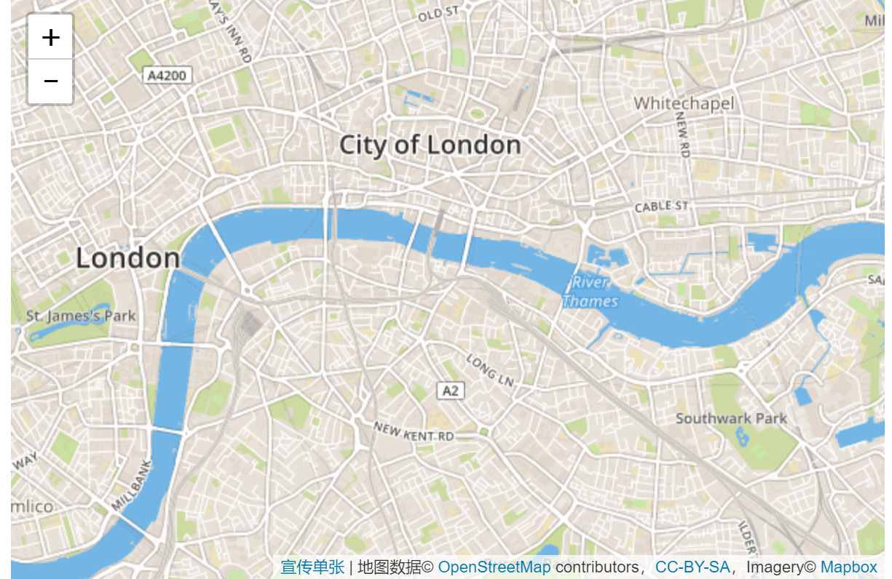
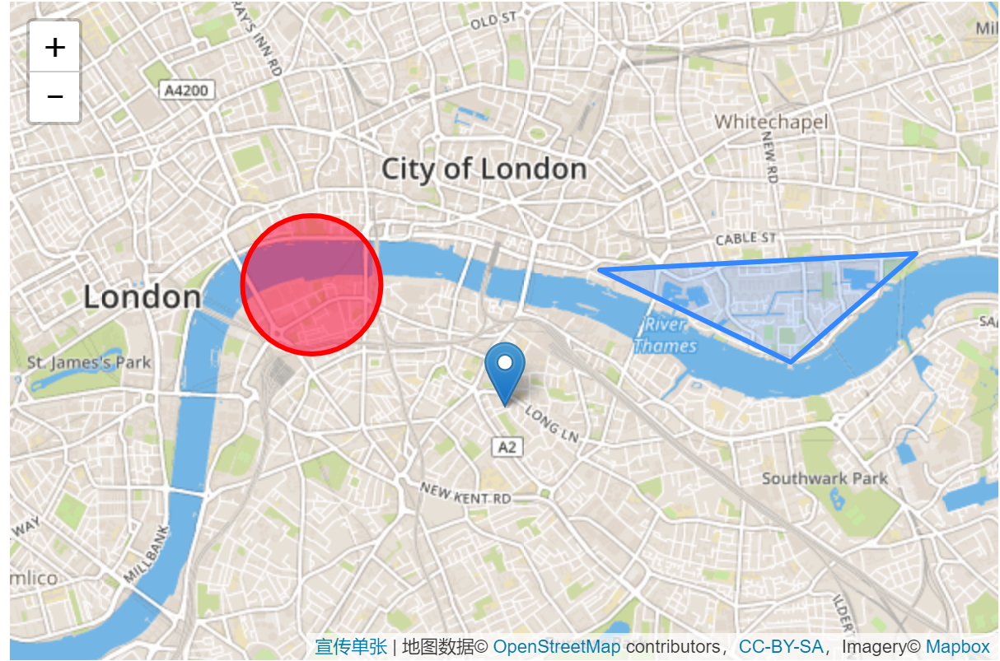
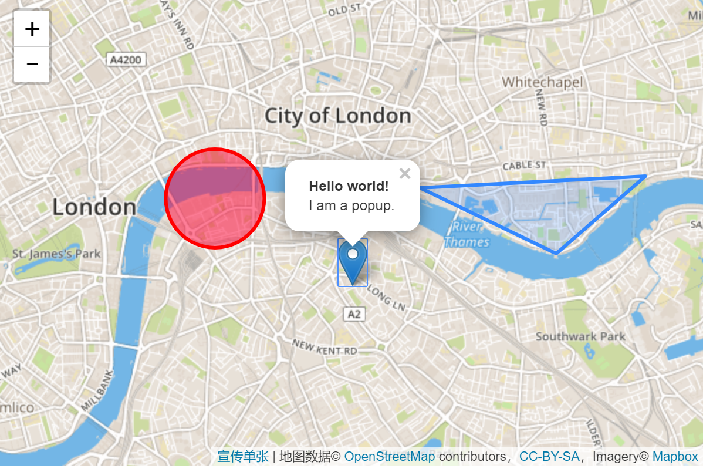

# 快速开始

## 基本操作

1.js和css引用

```html
 <link rel="stylesheet" href="https://unpkg.com/leaflet@1.5.1/dist/leaflet.css"
   integrity="sha512-xwE/Az9zrjBIphAcBb3F6JVqxf46+CDLwfLMHloNu6KEQCAWi6HcDUbeOfBIptF7tcCzusKFjFw2yuvEpDL9wQ=="
   crossorigin=""/>
   
<!-- Make sure you put this AFTER Leaflet's CSS -->
<script src="https://unpkg.com/leaflet@1.5.1/dist/leaflet.js"
  integrity="sha512-GffPMF3RvMeYyc1LWMHtK8EbPv0iNZ8/oTtHPx9/cc2ILxQ+u905qIwdpULaqDkyBKgOaB57QTMg7ztg8Jm2Og=="
  crossorigin=""></script>
```

2.将div元素您希望地图所在的位置：

```html
 <div id="mapid"></div>
```

3.设置div的大小

```html
#mapid { height: 180px; }
```

如果不设置高度的化，默认0px,会无法正常显示

4.初始化地图，并将其视图设置为我们选择的坐标中心和缩放级别

```js
var mymap = L.map('mapid').setView([51.505, -0.09], 13);
```
默认情况下（因为我们在创建地图实例时未传递任何选项），地图上的所有鼠标和触摸交互都已启用，并且具有缩放和归属控件。

5.接下来，我们将添加一个图层块添加到我们的地图中，下例中，它是一个Mapbox Streets图层块，可以自定义为百度图层块或是谷歌地图图层块

```js
L.tileLayer('https://api.tiles.mapbox.com/v4/{id}/{z}/{x}/{y}.png?access_token={accessToken}', {
    attribution: 'Map data &copy; <a href="https://www.openstreetmap.org/">OpenStreetMap</a> contributors, <a href="https://creativecommons.org/licenses/by-sa/2.0/">CC-BY-SA</a>, Imagery © <a href="https://www.mapbox.com/">Mapbox</a>',
    maxZoom: 18,
    id: 'mapbox.streets',
    accessToken: 'your.mapbox.access.token'
}).addTo(mymap);
```

效果：



## 标记，圆圈和多边形

除了图层块，您还可以轻松地向地图添加其他内容，包括标记，折线，多边形，圆形和弹出窗口。我们添加一个标记：

```js
var marker = L.marker([51.5, -0.09]).addTo(mymap);
```

添加圆是相同的（除了以米为单位指定半径作为第二个参数），但是允许您通过在创建对象时将选项作为最后一个参数传递来控制它的外观：

```js
var circle = L.circle([51.508, -0.11], {
    color: 'red',
    fillColor: '#f03',
    fillOpacity: 0.5,
    radius: 500
}).addTo(mymap);
```

添加多边形也非常简单：

```js
var polygon = L.polygon([
    [51.509, -0.08],
    [51.503, -0.06],
    [51.51, -0.047]
]).addTo(mymap);
```

以上操作的效果图：



## 使用弹出窗口

当您想要将某些信息附加到地图上的特定对象时，通常会使用弹出窗口。Leaflet有一个非常方便的快捷方式：

```js
marker.bindPopup("<b>Hello world!</b><br>I am a popup.").openPopup();
circle.bindPopup("I am a circle.");
polygon.bindPopup("I am a polygon.");
```

尝试点击我们的对象。该bindPopup方法将带有指定HTML内容的弹出窗口附加到标记，以便在单击对象时显示弹出窗口，并且该openPopup方法（仅用于标记）会立即打开附加的弹出窗口。

以上操作的效果图：



您还可以将弹出窗口用作图层（当您需要的不仅仅是将弹出窗口附加到对象时）：

```js
var popup = L.popup()
    .setLatLng([51.5, -0.09])
    .setContent("I am a standalone popup.")
    .openOn(mymap);
```

这里我们使用openOn而不是addTo，因为它在打开一个新的窗口会关闭之前打开的窗口

## 处理事件

每当Leaflet中发生某些事情时，例如用户点击标记或地图缩放更改，相应的对象就会发送一个您可以使用的函数订阅事件。它允许您对用户交互做出反应：

```js
function onMapClick(e) {
    alert("You clicked the map at " + e.latlng);
}

mymap.on('click', onMapClick);
```

每个对象都有自己的一组事件 - 有关详细信息，请参阅文档。侦听器函数的第一个参数是一个事件对象 - 它包含有关发生的事件的有用信息。例如，地图点击事件对象（e在上面的示例中）具有latlng属性，该属性是单击发生的位置。