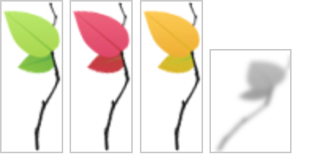
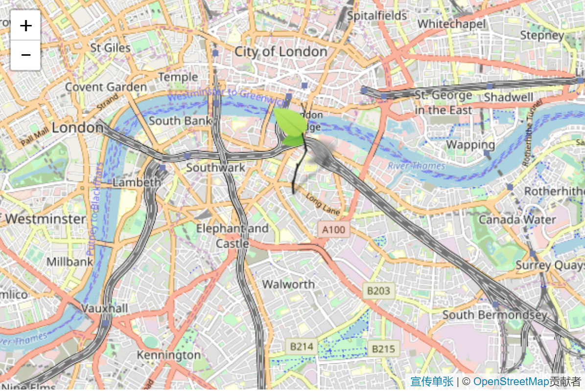

# 标记与自定义图标

## 准备图片

要自定义图标，我们通常需要两个图像 - 实际图标图像和阴影图像。在本教程中，我们采用了Leaflet徽标并创建了四个图像 - 三个不同颜色的叶子图像和一个阴影图像：



请注意，图像中的白色区域实际上是透明的

## 创建一个图标

Leaflet中的标记图标由L.Icon对象定义，这些对象在创建标记时作为选项传递。让我们创建一个绿叶图标：

```js
var greenIcon = L.icon({
    iconUrl: 'leaf-green.png',
    shadowUrl: 'leaf-shadow.png',

    iconSize:     [38, 95], // size of the icon
    shadowSize:   [50, 64], // size of the shadow
    iconAnchor:   [22, 94], // point of the icon which will correspond to marker's location
    shadowAnchor: [4, 62],  // the same for the shadow
    popupAnchor:  [-3, -76] // point from which the popup should open relative to the iconAnchor
});
```

现在在地图上放置带有此图标的标记很简单：

```js
L.marker([51.5, -0.09], {icon: greenIcon}).addTo(map);
```



## 定义图标类

如果我们需要创建几个有许多共同点的图标怎么办？让我们定义我们自己的包含共享选项的图标类，继承自L.Icon！Leaflet非常简单：

```js
var LeafIcon = L.Icon.extend({
    options: {
        shadowUrl: 'leaf-shadow.png',
        iconSize:     [38, 95],
        shadowSize:   [50, 64],
        iconAnchor:   [22, 94],
        shadowAnchor: [4, 62],
        popupAnchor:  [-3, -76]
    }
});
```

现在我们可以从这个类中创建所有三个叶子图标并使用它们：

```js
var greenIcon = new LeafIcon({iconUrl: 'leaf-green.png'}),
    redIcon = new LeafIcon({iconUrl: 'leaf-red.png'}),
    orangeIcon = new LeafIcon({iconUrl: 'leaf-orange.png'});
```
