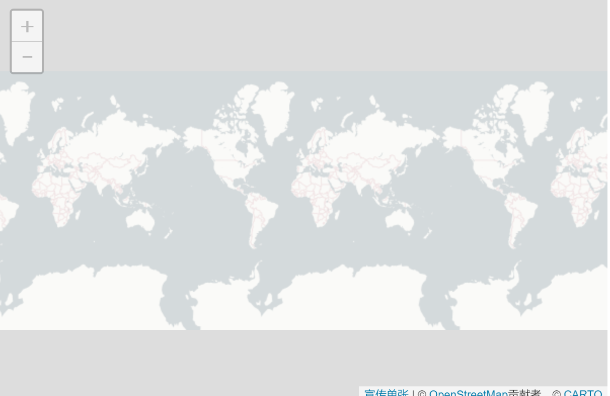

# 缩放级别

较低的缩放级别意味着地图显示整个大陆，而较高的缩放级别意味着地图可以显示城市的详细信息。

要了解缩放级别的工作原理，首先我们需要对大地测量进行基本介绍。

## 地球的形状

让我们看一下锁定在缩放零点的简单地图：

```js
var map = L.map('map', {
    minZoom: 0,
    maxZoom: 0
});

var cartodbAttribution = '&copy; <a href="https://www.openstreetmap.org/copyright">OpenStreetMap</a> contributors, &copy; <a href="https://carto.com/attribution">CARTO</a>';

var positron = L.tileLayer('https://{s}.basemaps.cartocdn.com/light_all/{z}/{x}/{y}.png', {
    attribution: cartodbAttribution
}).addTo(map);

map.setView([0, 0], 0);
```



请注意，“整个地球”只是一个图像，256像素宽，256像素高：


需要明确的是：地球不是正方形。相反，地球具有不规则的形状，可以近似于类似于球体的东西。

所以我们假设地球大多是圆的。为了使它平坦，我们放置一个假想的圆柱体，展开它，并切割它使它看起来像方形：

这不是在平面上显示地球表面的唯一方法。有数百种方式，每种方式都有自己的优点和缺点。

大地测量，地图投影和坐标系统等事情都很难，非常困难 （本教程的范围也不够）。假设地球是一个正方形并不总是正确的事情，但大多数时候工作得很好，使事情更简单，并允许Leaflet（和其他地图库）快速呈现。

现在，让我们假设世界是一个正方形：


当我们以缩放级别0表示世界时，它的宽度为256像素。当我们进入缩放级别1时，它的宽度和高度加倍，并且可以由四个256像素乘256像素的图像表示：


在每个缩放级别，每个图块被划分为四个，其大小（边缘的长度，由tileSize选项给出）加倍，使区域翻两番。（换句话说，世界的宽度和高度是像素）：256·2<sup>zoomlevel</sup>


这种情况一直持续下去。大多数磁贴服务提供最高为18级的磁贴，具体取决于其覆盖范围。这足以看到每个瓷砖的几个城市街区。

使用圆柱形投影的一个缺点是尺度不恒定，并且测量距离或尺寸不可靠，特别是在低变焦水平时。

在技术术语中，Leaflet使用的圆柱投影是共形的（保留形状），但不是等距的（不保留距离），而不是等面积 （不保留区域，因为赤道附近的东西看起来比它们小）。

通过向L.Control.Scale地图添加a 并平移到赤道和北纬60°，我们可以看到比例因子如何加倍。以下示例使用 javascript Timeout 自动执行此操作：

```js
L.control.scale().addTo(map);

setInterval(function(){
    map.setView([0, 0]);
    setTimeout(function(){
        map.setView([60, 0]);
    }, 2000);
}, 4000);
```

L.Control.Scale显示适用于地图中心点的比例。在高缩放级别，比例变化非常小，并且不明显。

## 控制缩放

有几种方法来控制显示的缩放级别，但最明显的一种是setZoom()。例如，map.setZoom(0); 将缩放级别设置map为0。

此示例再次使用Timeout缩放水平之间交替0和1自动：

```js
setInterval(function(){
    map.setZoom(0);
    setTimeout(function(){
        map.setZoom(1);
    }, 2000);
}, 4000);
```

其他设置缩放的方法是：

- setView(center, zoom)，这也设置了地图中心
- flyTo(center, zoom)，就像setView一个流畅的动画
- zoomIn()/zoomIn(delta)，默认情况下delta放大缩放级别1
- zoomOut()/zoomOut(delta)，默认情况下缩小delta缩放级别1
- setZoomAround(fixedPoint, zoom)，在保持点固定的同时设置缩放级别（滚轮缩放的功能）
- fitBounds(bounds)，自动计算缩放以适合地图上的矩形区域

## 分数缩放

Leaflet 1.0.0中引入的一个功能是分数缩放的概念。在此之前，该地图的缩放级别可能只是一个整数（0，1，2，等）; 但现在你可以使用像1.5或的分数1.25。

默认情况下禁用分数缩放。要启用它，请使用 地图zoomSnap选项。该zoomSnap选项的默认值1（这意味着该地图的缩放水平可以是0，1，2，等等）。

如果设置的值zoomSnap来0.5，地图的有效缩放级别会0，0.5，1，1.5，2，等。

如果你设定的值0.1，地图的有效缩放级别会0，0.1， 0.2，0.3，0.4，等。

以下示例使用以下zoomSnap值0.25：

```js
var map = L.map('map', {
    zoomSnap: 0.25
});
```

正如你所看到的，单张只会装载瓷砖的缩放级别0或1，并根据需要将它们进行缩放。

Leaflet会将缩放级别捕捉到最接近的有效级别。例如，如果您有zoomSnap: 0.25并且您尝试这样做map.setZoom(0.8)，则缩放将快照回复0.75。

zoomSnap可以设置为零。这意味着Leaflet 不会 捕捉缩放级别。

还有涉及到另一个重要的地图选项zoomSnap：该zoomDelta选项。这可以控制在使用缩放按钮（默认设置L.Control.Zoom）或键盘上的+/ -键时放大/缩小的缩放级别。

对于鼠标滚轮缩放，该wheelPxPerZoomLevel 选项控制鼠标滚轮放大的速度。


