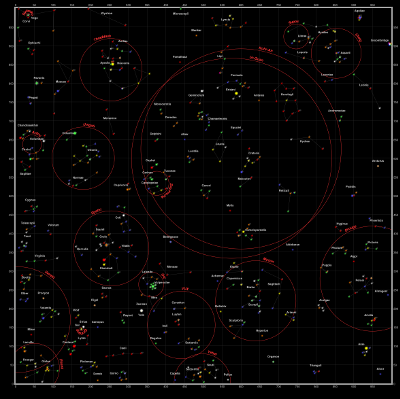
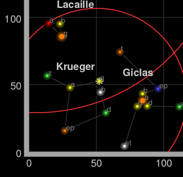
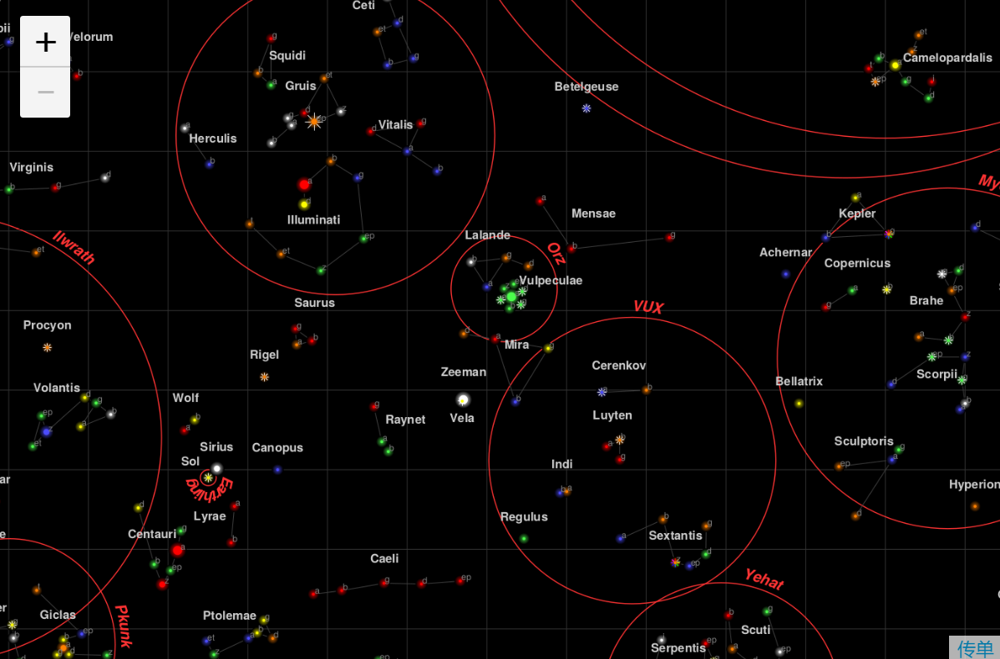

# 非地理地图

## 不是一个世界

有时，地图不代表地球表面的东西，因此，没有地理纬度和地理经度的概念。大多数情况下，这指的是大扫描图像，例如游戏地图。

在本教程中，我们从星际Ⅱ中选择了一个星图，这个游戏现在可以作为开源项目The Ur-Quan Masters使用。这些地图是用工具来读取游戏的开源数据文件的，如下所示：



游戏有一个内置的方形坐标系，可以在角落里看到。这将允许我们建立一个坐标系。



## CRS.Simple

CRS代表坐标参考系，这是地理学家用来解释坐标在坐标向量中的含义的术语。例如，[15, 60]如果在地球上使用纬度 - 经度，或在我们的星图中使用太阳系Krueger-Z ，则表示印度洋中的一个点。

Leaflet映射具有一个CRS（仅一个 CRS ），可在创建映射时更改。对于我们将使用的游戏地图，它代表一个正方形网格：CRS.Simple

```js
var map = L.map('map', {
    crs: L.CRS.Simple
});
```

然后我们可以添加一个L.ImageOverlay星图图像及其近似边界：

```js
var bounds = [[0,0], [1000,1000]];
var image = L.imageOverlay('uqm_map_full.png', bounds).addTo(map);
```

并显示整个地图：

```js
map.fitBounds(bounds);
```



## CRS.Simple地图中常见的陷阱

在默认的Leaflet CRS中CRS.Earth，360度经度被映射到256个水平像素（在缩放级别0），并且大约170度的纬度被映射到256个垂直像素（在缩放级别0）。

在一CRS.Simple，一个水平地图单元被映射到一个水平像素，以及同上垂直。这意味着整个地图大约1000x1000像素，不适合我们的HTML容器。幸运的是，我们可以将minZoom值设置为低于零：

```js
var map = L.map('map', {
    crs: L.CRS.Simple,
    minZoom: -5
});
```

## 像素与地图单位

使用时的一个常见错误CRS.Simple是假设地图单位等于图像像素。在这种情况下，地图覆盖1000x1000单位，但图像大2315x2315像素。不同的情况将要求一个像素=一个地图单位，或64个像素=一个地图单位，或任何东西。考虑网格中的地图单位，然后相应地添加图层（L.ImageOverlays，L.Markers等）。

事实上，我们使用的图像覆盖了超过1000个地图单​​位 - 有相当大的余地。测量0到1000坐标之间有多少像素，并进行外推，我们可以为此图像设置正确的坐标边界：

```js
var bounds = [[-26.5,-25], [1021.5,1023]];
var image = L.imageOverlay('uqm_map_full.png', bounds).addTo(map);
```

我们在这里时，让我们添加一些标记：

```js
var sol = L.latLng([ 145, 175.2 ]);
L.marker(sol).addTo(map);
map.setView( [70, 120], 1);
```

## 这不是你想要的LatLng

您会注意到Sol位于坐标处，[145,175]而不是[175,145]地图中心。坐标CRS.Simple采取的形式[y, x]代替[x, y]，以同样的方式单张使用[lat, lng]替代[lng, lat]。

