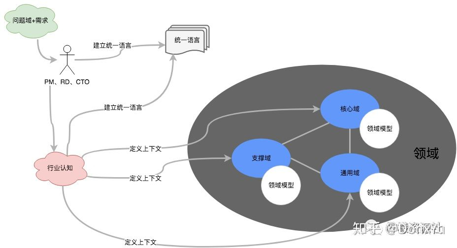
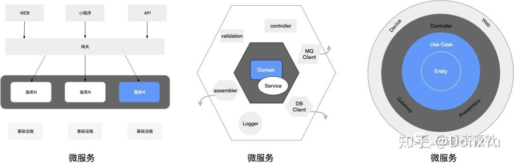
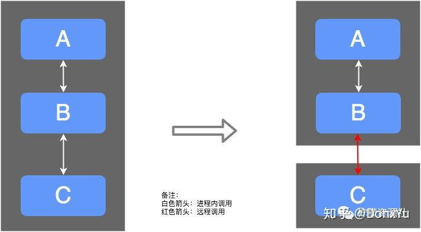

# DDD领域驱动设计

## DDD介绍

DDD 全称是 Domain-Driven Design，中文叫领域驱动设计，是一套应对复杂软件系统分析和设计的面向对象建模方法论。

以前的系统分析和设计是分开的，导致需求和成品非常容易出现偏差，两者相对独立，还会导致沟通困难，DDD 则打破了这种隔阂，提出了领域模型概念，统一了分析和设计编程，使得软件能够更灵活快速跟随需求变化。

### DDD 的发展史

1967 年有了 OOP，1982 年有了 OOAD（面向对象分析和设计），它是成熟版的 OOP，目标就是解决复杂业务场景，这个过程中逐渐形成了一个领域驱动的思潮，一转眼到 2003 年的时候，Eric Evans 发表了一篇著作 Domain-driven Design: Tackling Complexity in the Heart of Software，正式定义了领域的概念，开始了 DDD 的时代。算下来也有接近 20 年的时间了，但是，事实并不像 Eric Evans 设想的那样容易，DDD 似乎一直不温不火，没有能“风靡全球”。

2013 年，Vaughn Vernon 写了一本 Implementing Domain-Driven Design 进一步定义了 DDD 的领域方向，并且给出了很多落地指导，它让人们离 DDD 又进了一步。

同时期，随着互联网的兴起，Rod Johnson 这大哥以轻量级极简风格的 Spring Cloud 抢占了所有风头，虽然 Spring 推崇的失血模式并非 OOP 的皇家血统，但是谁用关心这些呢？毕竟简化开发的成本才是硬道理。

就在我们用这张口闭口 Spring 的时候，我们意识到了一个严重的问题，我们应对复杂业务场景的时候，Spring 似乎并不能给出更合理的解决方案，于是分而治之的思想下应生了微服务，一改以往单体应用为多个子应用，一下子让人眼前一亮，于是我们没日没夜地拆分服务，加之微服务提供的注册中心、熔断、限流等解决方案，我们用得不亦乐乎。

人们在踩过诸多拆分服务的坑（拆分过细导致服务爆炸、拆分不合理导致频分重构等）之后，开始死锁原因了，到底有没有一种方法论可以指导人们更加合理地拆分服务呢？众里寻他千百度，DDD 却在灯火阑珊处，有了 DDD 的指导，加之微服务的事件，才是完美的架构。

### DDD 与微服务的关系

背景中我们说到，有 DDD 的指导，加之微服务的事件，才是完美的架构，这里就详细说下它们的关系。

系统的复杂度越来越来高是必然趋势，原因可能来自自身业务的演进，也有可能是技术的创新，然而一个人和团队对复杂性的认知是有极限的，就像一个服务器的性能极限一样，解决的办法只有分而治之，将大问题拆解为小问题，最终突破这种极限。微服务在这方面都给出来了理论指导和最佳实践，诸如注册中心、熔断、限流等解决方案，但微服务并没有对“应对复杂业务场景”这个问题给出合理的解决方案，这是因为微服务的侧重点是治理，而不是分。

我们都知道，架构一个系统的时候，应该从以下几方面考虑：

1. 功能维度
2. 质量维度（包括性能和可用性）
3. 工程维度

微服务在第二个做得很好，但第一个维度和第三个维度做的不够。这就给 DDD 了一个“可乘之机”，DDD 给出了微服务在功能划分上没有给出的很好指导这个缺陷。所以说它们在面对复杂问题和构建系统时是一种互补的关系。

从架构角度看，微服务中的服务所关注的范围，正是 DDD 所推崇的六边形架构中的领域层，和整洁架构中的 entity 和 use cases 层。如下图所示：

### DDD 与微服务如何协作

知道了 DDD 与微服务还不够，我们还需要知道他们是怎么协作的。

一个系统（或者一个公司）的业务范围和在这个范围里进行的活动，被称之为领域，领域是现实生活中面对的问题域，和软件系统无关，领域可以划分为子域，比如电商领域可以划分为商品子域、订单子域、发票子域、库存子域 等，在不同子域里，不同概念会有不同的含义，所以我们在建模的时候必须要有一个明确的边界，这个边界在 DDD 中被称之为限界上下文，它是系统架构内部的一个边界，《整洁之道》这本书里提到：

>系统架构是由系统内部的架构边界，以及边界之间的依赖关系所定义的，与系统中组件之间的调用方式无关。
 所谓的服务本身只是一种比函数调用方式成本稍高的，分割应用程序行为的一种形式，与系统架构无关。

所以复杂系统划分的第一要素就是划分系统内部架构边界，也就是划分上下文，以及明确之间的关系，这对应之前说的第一维度（功能维度），这就是 DDD 的用武之处。其次，我们才考虑基于非功能的维度如何划分，这才是微服务发挥优势的地方。

假如我们把服务划分成 ABC 三个上下文：

我们可以在一个进程内部署单体应用，也可以通过远程调用来完成功能调用，这就是目前的微服务方式，更多的时候我们是两种方式的混合，比如 A 和 B 在一个部署单元内，C 单独部署，这是因为 C 非常重要，或并发量比较大，或需求变更比较频繁，这时候 C 独立部署有几个好处：

1. C 独立部署资源：资源更合理的倾斜，独立扩容缩容。
2. 弹力服务：重试、熔断、降级等，已达到故障隔离。
3. 技术栈独立：C 可以使用其他语言编写，更合适个性化团队技术栈。
4. 团队独立：可以由不同团队负责。

架构是可以演进的，所以拆分需要考虑架构的阶段，早期更注重业务逻辑边界，后期需要考虑更多方面，比如数据量、复杂性等，但即使有这个方针，也常会见仁见智，没有人能一下子将边界定义正确，其实这里根本就没有明确的对错。

即使边界定义的不太合适，通过聚合根可以保障我们能够演进出更合适的上下文，在上下文内部通过实体和值对象来对领域概念进行建模，一组实体和值对象归属于一个聚合根。

按照 DDD 的约束要求：

- 第一，聚合根来保证内部实体规则的正确性和数据一致性；
- 第二，外部对象只能通过 id 来引用聚合根，不能引用聚合根内部的实体；
- 第三，聚合根之间不能共享一个数据库事务，他们之间的数据一致性需要通过最终一致性来保证。

有了聚合根，再基于这些约束，未来可以根据需要，把聚合根升级为上下文，甚至拆分成微服务，都是比较容易的。

