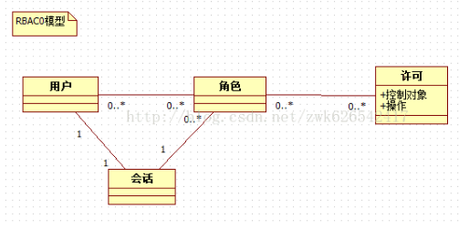
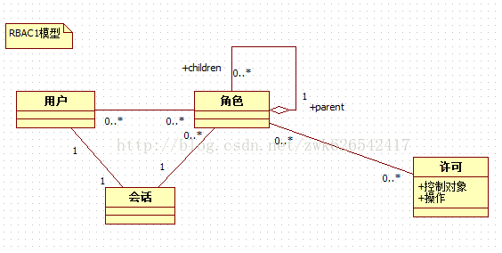
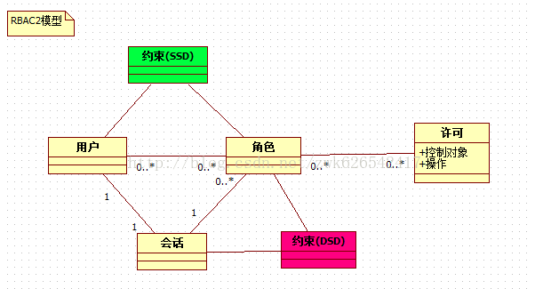
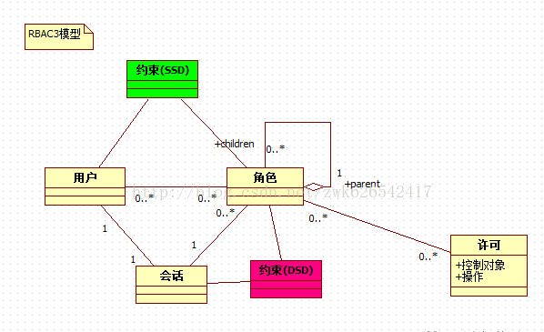

# RBAC概念理解

## RBAC是什么？

RBAC  是基于角色的访问控制（Role-Based Access Control ）在 RBAC  中，权限与角色相关联，用户通过成为适当角色的成员而得到这些角色的权限。这就极大地简化了权限的管理。这样管理都是层级相互依赖的，权限赋予给角色，而把角色又赋予用户，这样的权限设计很清楚，管理起来很方便。

## RBAC介绍

RBAC  认为授权实际上是Who 、What 、How 三元组之间的关系，也就是Who 对What 进行How 的操作，也就是“主体”对“客体”的操作。

**Who：是权限的拥有者或主体（如：User，Role）。**

**What：是操作或对象（operation，object）。**

**How：具体的权限（Privilege,正向授权与负向授权）。**

然后 RBAC  又分为RBAC0、RBAC1、RBAC2、RBAC3。

- RBAC0：是RBAC的核心思想。
- RBAC1：是把RBAC的角色分层模型。
- RBAC2：增加了RBAC的约束模型。
- RBAC3：其实是RBAC2 + RBAC1。

### RBAC0

RBAC0，它是RBAC的核心，RBAC1、RBAC2、RBAC3都是先后在RBAC0上的扩展。RBAC0定义了能构成RBAC控制系统的最小的元素集合，RBAC0由四部分构成：

- 用户（User）
- 角色（Role）
- 会话（Session）
- 许可（Pemission

其中许可又包括“操作”和“控制对象”其中许可被赋予角色，而不是用户，当一个角色被指定给一个用户时，此用户就拥有了该角色所包含的许可。会话是动态的概念，用户必须通过会话才可以设置角色，是用户与激活的角色之间的映射关系。

### RBAC1

RBAC1，它是RBAC角色的分层模型，RBAC1建立在RBAC0基础之上，在角色中引入了继承的概念，有了继承那么角色就有了上下级或者等级关系，角色间的继承关系可分为一般继承关系和受限继承关系。一般继承关系仅要求角色继承关系是一个绝对偏序关系，允许角色间的多继承。而受限继承关系则进一步要求角色继承关系是一个树结构，实现角色间的单继承。

这种模型合适于角色之间的层次明确，包含明确。

### RBAC2

RBAC2，它是RBAC的约束模型，RBAC2也是建立的RBAC0的基础之上的，在RBAC0基础上假如了约束的概念，主要引入了静态职责分离SSD(Static Separation of Duty)和动态职责分离DSD(Dynamic Separation of Duty)。

SSD是用户和角色的指派阶段加入的，主要是对用户和角色有如下约束:

- 互斥角色：同一个用户在两个互斥角色中只能选择一个
- 基数约束：一个用户拥有的角色是有限的，一个角色拥有的许可也是有限的
- 先决条件约束：用户想要获得高级角色，首先必须拥有低级角色

DSD是会话和角色之间的约束，可以动态的约束用户拥有的角色，如一个用户可以拥有两个角色，但是运行时只能激活一个角色。

### RBAC3

RBAC3，它是RBAC1与RBAC2合集，所以RBAC3是既有角色分层又有约束的一种模型

