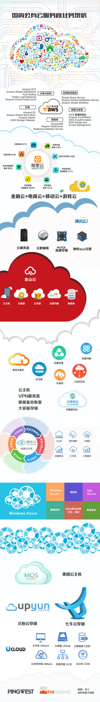
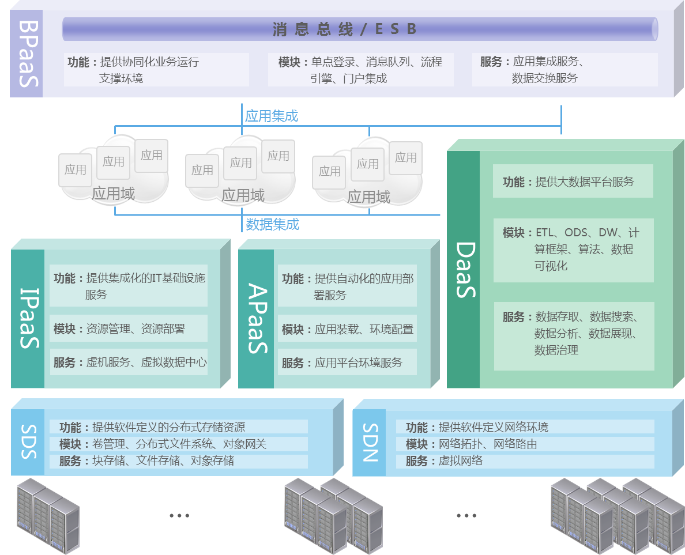
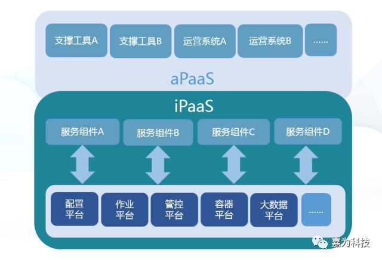
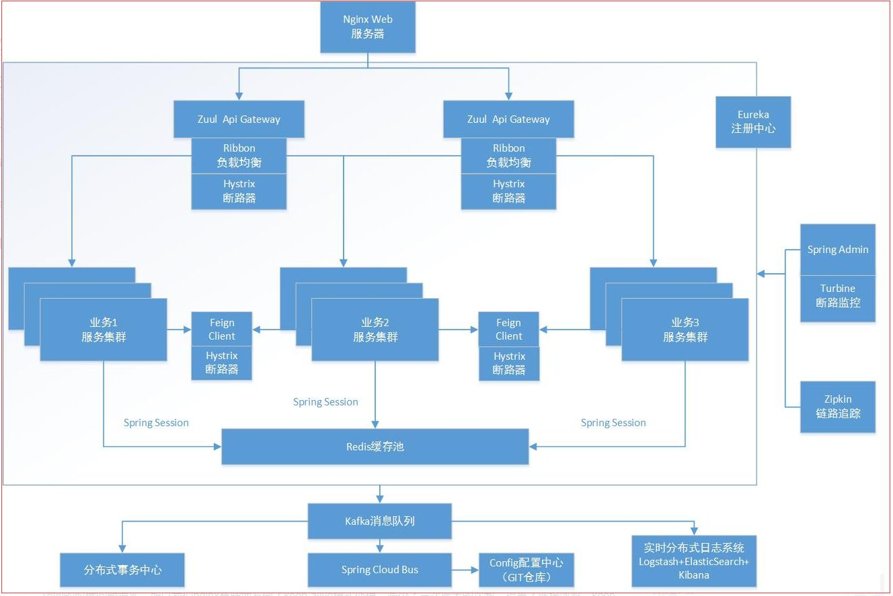
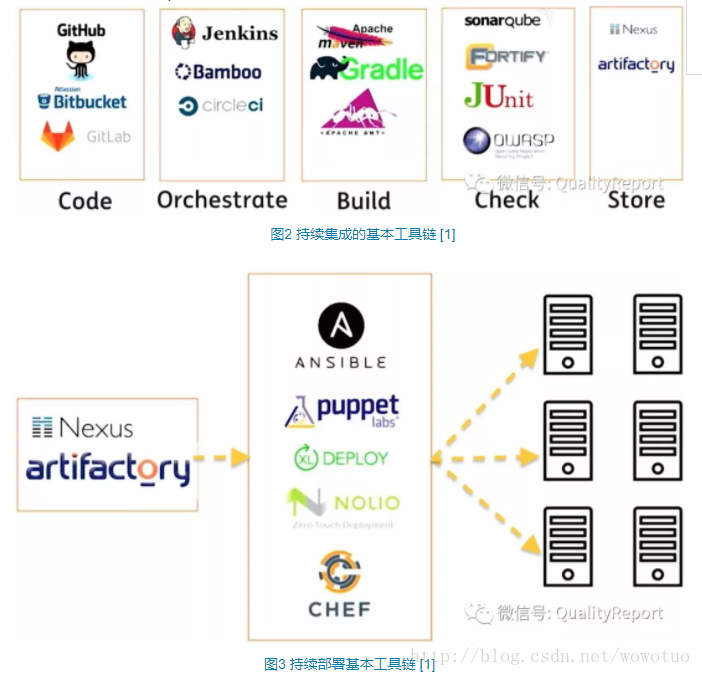
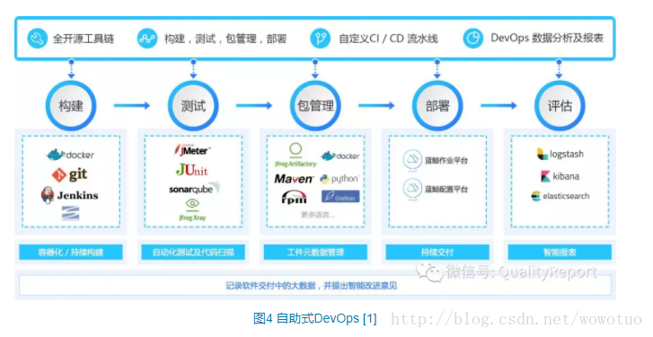
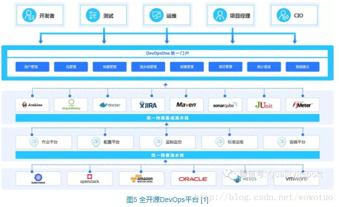

# 云化概念理解

## 云的概念

通过使计算分布在大量的分布式计算机上，而非本地计算机或远程服务器中，企业数据中心的运行将更与互联网相似。这使得企业能够将资源切换到需要的应用上，根据需求访问计算机和存储系统。

国内云服务行业发展情况

## Iaas，Paas，Saas理解

### IaaS: Infrastructure-as-a-Service（基础设施即服务）

提供给消费者的服务是对所有计算基础设施的利用，包括处理CPU、内存、存储、网络和其它基本的计算资源，用户能够部署和运行任意软件，包括操作系统和应用程序。

典型产品：苏研云平台，阿里云，腾讯云

### PaaS: Platform-as-a-Service（平台即服务）

提供给消费者的服务是把客户采用提供的开发语言和工具（例如Java，python, .Net等）开发的或收购的应用程序部署到供应商的云计算基础设施上去。客户不需要管理或控制底层的云基础设施，包括网络、服务器、操作系统、存储等，但客户能控制部署的应用程序，也可能控制运行应用程序的托管环境配置；

其实标准的PaaS可以分为三层，一类是应用部署和运行平台APaaS（application platform as a service)，另一类是集成平台IPaaS（integration platform as a service），还有一类是 dPaaS 数据平台即服务（Data Platform as a Service）

**注意：各个公司理解不同，需要区别对待**

下图是一般理解

典型产品：bomc监控，告警，cmdb，操作管理中心，自动化运维，大数据管理

### SaaS(Software-as-a- Service)：软件即服务

通过Internet提供软件，用户无需购买软件，按需租用即可。

典型产品：各个系统

## 微服务理解

微服务是一种架构风格，一个大型复杂软件应用由一个或多个微服务组成。系统中的各个微服务可被独立部署，各个微服务之间是松耦合的。每个微服务仅关注于完成一件任务并很好地完成该任务。在所有情况下，每个任务代表着一个小的业务能力。

一个微服务架构的应用程序有下列特性：

- 每个服务都容易被取代。
- 服务是以能力来组织的，例如使用者界面、前端、推荐系统、账单或是物流等。
- 由于功能被拆成多个服务，因此可以由不同的编程语言、数据库实作。
- 架构是对称而非分层（即生产者与消费者的关系）。

一个微服务架构：

- 适用于具持续交付 (Continuous Delivery) 的软件开发流程。
- 与服务导向架构 (Service-Oriented Architecture) 不同，后者是整合各种业务的应用程序，但微服务只属于一个应用程序。

不限于语言，java，go，c#都可以，但是整体的一个解决方案来说，java的spring cloud

微服务来说是指开发模式，主要是运行于SaaS和PaaS两层

## docker的理解

Docker 是一个开源的应用容器引擎，让开发者可以打包他们的应用以及依赖包到一个可移植的容器中，然后发布到任何流行的 Linux 机器上，也可以实现虚拟化。容器是完全使用沙箱机制，相互之间不会有任何接口。

Docker再windows上面一律不行，docker是一种类似轻型的虚拟机技术，相当于再应用外面包一层容器，然后通过容器来进行部署分发

举个例子来说：docker就是包装，把内容都打包成商品，去卖，具体在哪里销售，买了以后在哪里使用，或是怎么使用，就是用户的事情了

和微服务不一样，docker只属于PaaS，和SaaS无关

docker只是一个关于容器的技术，具体调度，弹性伸缩，等等，是由Kubernetes来进行

## DevOps的概念

只归属于PaaS层，自动化部署和自动化运维再目前来看，都归属于DevOps

DevOps（Development和Operations的组合词）是一组过程、方法与系统的统称，用于促进开发（应用程序/软件工程）、技术运营和质量保障（QA）部门之间的沟通、协作与整合。可以把DevOps看作开发（软件工程）、技术运营和质量保障（QA）三者的交集

涉及的工具链

代码管理（SCM）：GitHub、GitLab、BitBucket、SubVersion

构建工具：Ant、Gradle、maven

自动部署：Capistrano、CodeDeploy

持续集成（CI）：Bamboo、Hudson、Jenkins

配置管理：Ansible、Chef、Puppet、SaltStack、ScriptRock GuardRail

容器：Docker、LXC、第三方厂商如AWS

编排：Kubernetes、Core、Apache Mesos、DC/OS

服务注册与发现：Zookeeper、etcd、Consul

脚本语言：python、ruby、shell

日志管理：ELK、Logentries

系统监控：Datadog、Graphite、Icinga、Nagios

性能监控：AppDynamics、New Relic、Splunk

压力测试：JMeter、Blaze Meter、loader.io

预警：PagerDuty、pingdom、厂商自带如AWS SNS

HTTP加速器：Varnish

消息总线：ActiveMQ、SQS

应用服务器：Tomcat、JBoss

Web服务器：Apache、Nginx、IIS

数据库：MySQL、Oracle、PostgreSQL等关系型数据库；cassandra、mongoDB、redis等NoSQL数据库

项目管理（PM）：Jira、Asana、Taiga、Trello、Basecamp、Pivotal Tracker

主要流行工具：

流程为：

使用场景为:

