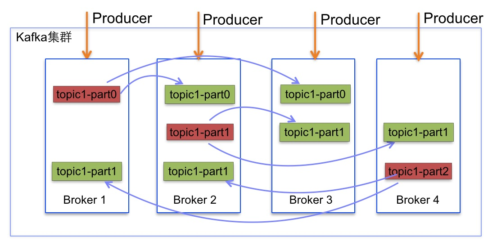
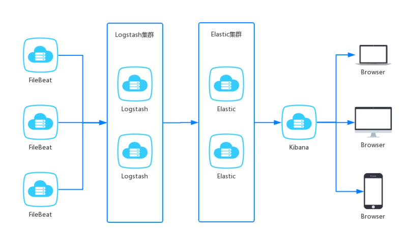
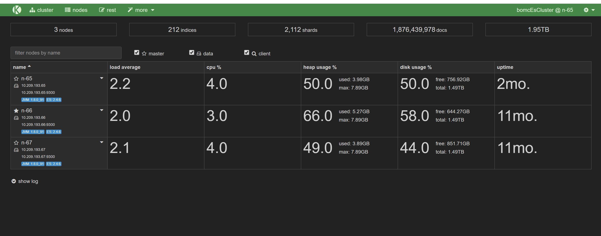
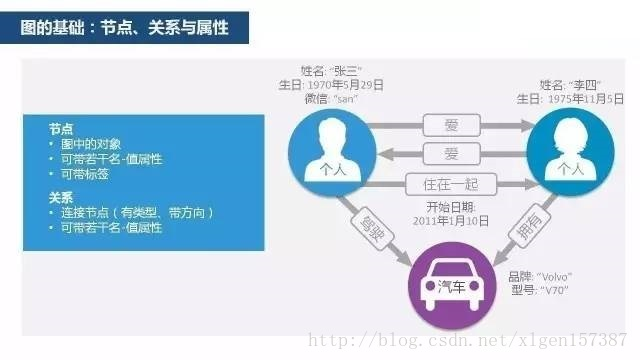

# 常用的中间件的介绍

## 集群基本概念

### 高可用性集群

它是利用集群中系统 的冗余，当系统中某台机器发生损坏的时候，其他后备的机器可以迅速的接替它来启动服务，等待故障机的维修和返回。最大限度的保证集群中服务的可用性。


### 负载均衡集群

它是利用一个集群中的多台单机，完成许多并行的小的工作。一般情况下，如果一个应用使用的人多了，那么用户请求的相应时间就会增大，机器的性能也会受到影响，如果使用负载均衡集群，那么集群中任意一台机器都能相应用户的请求，这样集群就会在用户发出服务请求之后，选择当时负载最小，能够提供最好的服务的这台机器来接受请求并相应，这样就可用用集群来增加系统的可用性和稳定性。这类集群在网站中使用较多；

负责均衡服务器根据负载均衡算法（轮询，随机，哈希，权重等）来分发请求到不同的主服务器。

每个主服务器都是等价的，都可以完成相同的功能


### 分布式集群

分布式集群的各个服务器是用来完成不同系统功能的，通过各个服务器一起工作来完成一件事情。

当前流行的大数据中间件几乎全部是分布式集群，因为和硬件关联性比较紧密，性能瓶颈无法做到无限的负载拓展


## 中间件

### zookeeper

ZooKeeper是一个分布式的，开放源码的分布式应用程序协调服务，是Google的Chubby一个开源的实现，是Hadoop和Hbase的重要组件，它是集群的管理者，监视着集群中各个节点的状态根据节点提交的反馈进行下一步合理操作。最终，将简单易用的接口和性能高效、功能稳定的系统提供给用户

ZooKeeper 是一个典型的分布式数据一致性解决方案，分布式应用程序可以基于 ZooKeeper 实现诸如数据发布/订阅、负载均衡、命名服务、分布式协调/通知、集群管理、Master 选举、分布式锁和分布式队列等功能。

最常用的使用场景就是用于担任服务生产者和服务消费者的注册中心

服务生产者将自己提供的服务注册到 ZooKeeper 中心，服务的消费者在进行服务调用的时候先到 ZooKeeper 中查找服务，获取到服务生产者的详细信息之后，再去调用服务生产者的内容与数据。

为了保证高可用，最好是以集群形态来部署 ZooKeeper，这样只要集群中大部分机器是可用的（能够容忍一定的机器故障），那么 ZooKeeper 本身仍然是可用的。

客户端在使用 ZooKeeper 时，需要知道集群机器列表，通过与集群中的某一台机器建立 TCP 连接来使用服务。

客户端使用这个 TCP 链接来发送请求、获取结果、获取监听事件以及发送心跳包。如果这个连接异常断开了，客户端可以连接到另外的机器上。


上图中每一个 Server 代表一个安装 ZooKeeper 服务的服务器。组成 ZooKeeper 服务的服务器都会在内存中维护当前的服务器状态，并且每台服务器之间都互相保持着通信。

集群间通过 Zab 协议（Zookeeper Atomic Broadcast）来保持数据的一致性。

Zab 核心思想是当多数 Server 写成功，则任务数据写成功：

如果有 3 个 Server，则最多允许 1 个 Server 挂掉。 如果有 4 个 Server，则同样最多允许 1 个 Server 挂掉。 既然 3 个或者 4 个 Server，同样最多允许 1 个 Server 挂掉，那么它们的可靠性是一样的。

所以选择2n+1个 ZooKeeper Server 即可，这里选择 3 个 Server。

ZooKeeper拥有一个层次的命名空间，这个和标准的文件系统非常相似


### kafka

kafka是一个分布式消息队列。具有高性能、持久化、多副本备份、横向扩展能力。生产者往队列里写消息，消费者从队列里取消息进行业务逻辑。一般在架构设计中起到解耦、削峰、异步处理的作用。

kafka对外使用topic的概念，生产者往topic里写消息，消费者从读消息。为了做到水平扩展，一个topic实际是由多个partition组成的，会根据分区规则选择把消息存储到哪个分区中，只要如果分区规则设置的合理，那么所有的消息将会被均匀的分布到不同的分区中，这样就实现了负载均衡和水平扩展。另外，多个订阅者可以从一个或者多个分区中同时消费数据，由于消息是以追加到分区中的，多个分区顺序写磁盘的总效率要比随机写内存还要高（引用Apache Kafka – A High Throughput Distributed Messaging System的观点），是Kafka高吞吐率的重要保证之一

Kafka每个topic的partition有N个副本，其中N是topic的复制因子。Kafka通过多副本机制实现故障自动转移，当Kafka集群中一个Broker失效情况下仍然保证服务可用



比较流行的管理工具kafka manager

查看集群及概况


查看具体的topic情况，包括分区，副本


### storm

Storm是一个免费并开源的分布式实时计算系统。利用Storm可以很容易做到可靠地处理无限的数据流，像Hadoop批量处理大数据一样，Storm可以实时处理数据。Storm简单，可以使用任何编程语言。

在Storm之前，进行实时处理是非常痛苦的事情: 需要维护一堆消息队列和消费者，他们构成了非常复杂的图结构。消费者进程从队列里取消息，处理完成后，去更新数据库，或者给其他队列发新消息。

这样进行实时处理是非常痛苦的。我们主要的时间都花在关注往哪里发消息，从哪里接收消息，消息如何序列化，真正的业务逻辑只占了源代码的一小部分。一个应用程序的逻辑运行在很多worker上，但这些worker需要各自单独部署，还需要部署消息队列。最大问题是系统很脆弱，而且不是容错的：需要自己保证消息队列和worker进程工作正常。

Storm完整地解决了这些问题。它是为分布式场景而生的，抽象了消息传递，会自动地在集群机器上并发地处理流式计算，让你专注于实时处理的业务逻辑。


Storm框架主要由7部分组成

- Topology：一个实时应用的计算任务被打包作为Topology发布，这同Hadoop的MapReduce任务相似。
- Spout：Storm中的消息源，用于为Topology生产消息（数据），一般是从外部数据源（如Message Queue、RDBMS、NoSQL、Realtime Log）不间断地读取数据并发送给Topology消息（tuple元组）。
- Bolt：Storm中的消息处理者，用于为Topology进行消息的处理，Bolt可以执行过滤，聚合， 查询数据库等操作，而且可以一级一级的进行处理。
- Stream：产生的数据（tuple元组）。
- Stream grouping：在Bolt任务中定义的Stream进行区分。
- Task：每个Spout或者Bolt在集群执行许多任务。
- Worker：Topology跨一个或多个Worker节点的进程执行。

Storm集群组成

- Nimbus：即Storm的Master，负责资源分配和任务调度。一个Storm集群只有一个Nimbus。
- Supervisor：即Storm的Slave，负责接收Nimbus分配的任务，管理所有Worker，一个Supervisor节点中包含多个Worker进程。

集群架构图：


task结构：


举例说明：单词计数器


自带管理工具：


### ELK

ELK是三个开源软件的缩写，分别表示：Elasticsearch , Logstash, Kibana , 它们都是开源软件。新增了一个FileBeat，它是一个轻量级的日志收集处理工具(Agent)，Filebeat占用资源少，适合于在各个服务器上搜集日志后传输给Logstash，官方也推荐此工具。

Elasticsearch是个开源分布式搜索引擎，提供搜集、分析、存储数据三大功能。它的特点有：分布式，零配置，自动发现，索引自动分片，索引副本机制，restful风格接口，多数据源，自动搜索负载等。

Logstash 主要是用来日志的搜集、分析、过滤日志的工具，支持大量的数据获取方式。一般工作方式为c/s架构，client端安装在需要收集日志的主机上，server端负责将收到的各节点日志进行过滤、修改等操作在一并发往elasticsearch上去。

Kibana 也是一个开源和免费的工具，Kibana可以为 Logstash 和 ElasticSearch 提供的日志分析友好的 Web 界面，可以帮助汇总、分析和搜索重要数据日志。

Filebeat隶属于Beats。目前Beats包含四种工具：

- Packetbeat（搜集网络流量数据）
- Topbeat（搜集系统、进程和文件系统级别的 CPU 和内存使用情况等数据）
- Filebeat（搜集文件数据）
- Winlogbeat（搜集 Windows 事件日志数据）

整体结构：



Elasticsearch使用示例：




kibana使用示例：


### flume

flume 作为 cloudera 开发的实时日志收集系统，受到了业界的认可与广泛应用。Flume 初始的发行版本目前被统称为 Flume OG（original generation），属于 cloudera。重构核心组件、核心配置以及代码架构后的版本统称为 Flume NG（next generation）；改动的另一原因是将 Flume 纳入 apache 旗下，cloudera Flume 改名为 Apache Flume。

flume是一个分布式、可靠、和高可用的海量日志采集、聚合和传输的系统。支持在日志系统中定制各类数据发送方，用于收集数据;同时，Flume提供对数据进行简单处理，类似logstash

结构图：


三段式的结构：源（Source输入）——存储（Channel管道）——出口（Sink目标输出）

Flume已经可以支持一个Agent中有多个不同类型的channel和sink，我们可以选择把Source的数据复制，分发给不同的目的端口，比如：


### redis,mongodb

redis是一种支持Key-Value等多种数据结构的存储系统。可用于缓存，事件发布或订阅，高速队列等场景。该数据库使用ANSI C语言编写，支持网络，提供字符串，哈希，列表，队列，集合结构直接存取，基于内存，可持久化。

注： redis中的value内部可以支持各种数据结构类型，比如可以存入一个普通的string，还可以存list，set，hashmap，sortedSet（有序的set）

redis的应用场景有哪些

- 会话缓存（最常用）
- 消息队列，比如支付
- 活动排行榜或计数
- 发布，订阅消息（消息通知）
- 商品列表，评论列表等

MongoDB 是一个介于关系数据库和非关系数据库之间的产品，是非关系数据库当中功能最丰富，最像关系数据库的。


### 时序数据库influxdb,OpenTSDB

先来介绍什么是时序数据。时序数据是基于时间的一系列的数据。在有时间的坐标中将这些数据点连成线，往过去看可以做成多纬度报表，揭示其趋势性、规律性、异常性；往未来看可以做大数据分析，机器学习，实现预测和预警。

时序数据库就是存放时序数据的数据库，并且需要支持时序数据的快速写入、持久化、多纬度的聚合查询等基本功能。

对比传统数据库仅仅记录了数据的当前值，时序数据库则记录了所有的历史数据。同时时序数据的查询也总是会带上时间作为过滤条件。

所有有时序数据产生，并且需要展现其历史趋势、周期规律、异常性的，进一步对未来做出预测分析的，都是时序数据库适合的场景


时序数据库全称为时间序列数据库。时间序列数据库主要用于指处理带时间标签（按照时间的顺序变化，即时间序列化）的数据，带时间标签的数据也称为时间序列数据。

#### influxdb

非常优秀的时序数据库，但只有单机版是免费开源的，集群版本是要收费的。从单机版本中可以一窥其存储方案：在单机上InfluxDB采取类似于LSM tree的存储结构TSM；而分片的方案InfluxDB先通过<database>+<timestamp>（事实上还要加上retentionPolicy）确定ShardGroup，再通过<metric>+<tags>的hash code确定到具体的Shard。

这里timestamp默认情况下是7天对齐，也就是说7天的时序数据会在一个Shard中。

#### OpenTSDB

底层使用Hbase作为其分布式存储引擎，采用的也是LSM tree。

Hbase采用范围划分的分片方式。使用row key做分片，保证其全局有序。每个row key下可以有多个column family。每个column family下可以有多个column。

他的timestamp是小时对齐的，也就是说一个row key下最多存储一个小时的数据。并且需要将构成row key的metric和tags都转成对应的uid来减少存储空间，避免Hfile索引太大。下图是真实的row key示例。

### 图形数据库Neo4J

图形数据库是NoSQL数据库的一种类型，它应用图形理论存储实体之间的关系信息。图形数据库是一种非关系型数据库，它应用图形理论存储实体之间的关系信息。最常见例子就是社会网络中人与人之间的关系。

例如一部电影中的各个演员常常有主角配角之分，还要有导演，特效等人员的参与。通常情况下这些人员常常都被抽象为Person类型，对应着同一个数据库表。同时一位导演本身也可以是其它电影或者电视剧的演员，更可能是歌手，甚至是某些影视公司的投资者（没错，我这个例子的确是以赵薇为模板的）。而这些影视公司则常常是一系列电影，电视剧的资方。这种彼此关联的关系常常会非常复杂，而且在两个实体之间常常同时存在着多个不同的关系：


在尝试使用关系型数据库对这些关系进行建模时，我们首先需要建立表示各种实体的一系列表：表示人的表，表示电影的表，表示电视剧的表，表示影视公司的表等等。这些表常常需要通过一系列关联表将它们关联起来：通过这些关联表来记录一个人到底参演过哪些电影，参演过哪些电视剧，唱过哪些歌，同时又是哪些公司的投资方。同时我们还需要创建一系列关联表来记录一部电影中哪些人是主角，哪些人是配角，哪个人是导演，哪些人是特效等。可以看到，我们需要大量的关联表来记录这一系列复杂的关系。在更多实体引入之后，我们将需要越来越多的关联表，从而使得基于关系型数据库的解决方案繁琐易错。

更加复杂的话：


图数据库源起欧拉和图理论，也可称为面向/基于图的数据库，对应的英文是Graph Database。图数据库的基本含义是以“图”这种数据结构存储和查询数据，而不是存储图片的数据库。它的数据模型主要是以节点和关系（边）来体现，也可处理键值对。它的优点是快速解决复杂的关系问题。

图具有如下特征：

- 包含节点和边；
- 节点上有属性（键值对）；
- 边有名字和方向，并总是有一个开始节点和一个结束节点；
- 边也可以有属性。



#### Neo4j

Neo4j的安装使用很简单，如果是Window平台的话直接安装就可以，然后配置一下环境变量即可使用！这里不再介绍，下边看一下简单使用。

Neo4j浏览器：

Neo4j服务器具有一个集成的浏览器，在一个运行的服务器实例上访问 “http://localhost:7474/”，打开浏览器，显示启动页面：


图数据库它善于处理大量的、复杂的、互联的、多变的网状数据，其效率远远高于传统的关系型数据库的百倍、千倍甚至万倍。图数据库特别适用于社交网络、实时推荐、银行交易环路、金融征信系统等广泛的领域。领英、沃尔玛、CISCO、HP、eBay等全球知名企业都在使用图数据库Neo4j，中国企业也在逐步开始用图数据库来构建自己的应用。

## 工具

### 自动化构建

Java世界中主要有三大构建工具：Ant、Maven和Gradle

#### Ant

Ant是第一个“现代”构建工具，在很多方面它有些像Make。2000年发布，在很短时间内成为Java项目上最流行的构建工具。它的学习曲线很缓，因此不需要什么特殊的准备就能上手。它基于过程式编程的idea。在最初的版本之后，逐渐具备了支持插件的功能。

主要的不足是用XML作为脚本编写格式。 XML，本质上是层次化的，并不能很好地贴合Ant过程化编程的初衷。Ant的另外一个问题是，除非是很小的项目，否则它的XML文件很快就大得无法管理。

后来，随着通过网络进行依赖管理成为必备功能，Ant采用了Apache Ivy。

Ant的主要优点在于对构建过程的控制上。

#### Maven

Maven发布于2004年。目的是解决码农使用Ant所带来的一些问题。

Maven仍旧使用XML作为编写构建配置的文件格式，但是，文件结构却有巨大的变化。Ant需要码农将执行task所需的全部命令都一一列出，然而Maven依靠约定（convention）并提供现成的可调用的目标（goal）。不仅如此，有可能最重要的一个补充是，Maven具备从网络上自动下载依赖的能力（Ant后来通过Ivy也具备了这个功能），这一点革命性地改变了我们开发软件的方式。

但是，Maven也有它的问题。依赖管理不能很好地处理相同库文件不同版本之间的冲突（Ivy在这方面更好一些）。XML作为配置文件的格式有严格的结构层次和标准，定制化目标（goal）很困难。因为Maven主要聚焦于依赖管理，实际上用Maven很难写出复杂、定制化的构建脚本，甚至不如Ant。

用XML写的配置文件会变得越来越大，越来越笨重。在大型项目中，它经常什么“特别的”事还没干就有几百行代码。

Maven的主要优点是生命周期。只要项目基于一定之规，它的整个生命周期都能够轻松搞定，代价是牺牲了灵活性。

在对DSL（Domain Specific Languages)的热情持续高涨之时，通常的想法是设计一套能够解决特定领域问题的语言。在构建这方面，DSL的一个成功案例就是Gradle。

#### Gradle

Gradle结合了前两者的优点，在此基础之上做了很多改进。它具有Ant的强大和灵活，又有Maven的生命周期管理且易于使用。最终结果就是一个工具在2012年华丽诞生并且很快地获得了广泛关注。例如，Google采用Gradle作为Android OS的默认构建工具。

Gradle不用XML，它使用基于Groovy的专门的DSL，从而使Gradle构建脚本变得比用Ant和Maven写的要简洁清晰。Gradle样板文件的代码很少，这是因为它的DSL被设计用于解决特定的问题：贯穿软件的生命周期，从编译，到静态检查，到测试，直到打包和部署。

它使用Apache Ivy来处理Jar包的依赖。

Gradle的成就可以概括为：约定好，灵活性也高。

### 自动化持续集成部署

Jenkins 是一个开源软件项目，旨在提供一个开放易用的软件平台，使软件的持续集成变成可能。Jenkins是基于 Java 开发的一种持续集成工具，用于监控持续重复的工作，功能包括：

- 持续的软件版本发布/测试项目。
- 监控外部调用执行的工作。

#### 持续集成（Continuous integration，简称 CI）

持续集成是指开发者在代码的开发过程中，可以频繁的将代码部署集成到主干，并进程自动化测试


#### 持续交付（Continuous delivery，缩写为 CD）

持续交付指的是在持续集成的环境基础之上，将代码部署到预生产环境


#### 持续部署

在持续交付的基础上，把部署到生产环境的过程自动化，持续部署和持续交付的区别就是最终部署到生产环境是自动化的。


Jenkins是一个广泛用于持续构建的可视化web工具，就是各种项目的的“自动化”编译、打包、分发部署，将以前编译、打包、上传、部署到Tomcat中的过程交由Jenkins，Jenkins通过给定的代码地址，将代码拉取到jenkins宿主机上，进行编译、打包和发布到web容器中。Jenkins可以支持多种语言（比如：java、c#、php等等），也兼容ant、maven、gradle等多种第三方构建工具，同时跟git、svn无缝集成，也支持直接与github直接集成。


Jenkins的插件极为丰富，涉及持续集成，持续交付，持续部署的功能基本都可以涵盖，甚至包含android，windows，等各种系统的各种功能对应插件。

### 自动化测试


selenium


### 自动化运维

虚拟化技术日益普及，基于行业标准的服务器功能越来越强大，加上云计算的出现，这些因素共同导致了企业内外需要加以管理的服务器数量大幅增长。过去我们只要管理内部数据中心里面的物理服务器机架，而现在我们要管理多得多的服务器，它们有可能遍布全球各地。

这时候，数据中心协调和配置管理工具就派得上用场。在许多情况下，我们管理大批同样的服务器，它们运行同样的应用程序和服务。这些服务器部署在企业内部的虚拟化框架上，或者作为云计算或托管实例在远程数据中心运行。在一些情况下，我们可能谈论的是完全为了支持超大应用系统而存在的大型环境，或者是支持无数小型服务的大型环境。不管怎么样，让它们都乖乖听从管理员的指挥这种能力不可小视。这是管理这些越来越庞大的基础设施的唯一方式。

Puppet、Chef、Ansible和Salt都是为了实现这个目标而开发的：让用户极容易配置和维护数十台、数百台、乃至数千台服务器。这倒不是说小公司就不会得益于这些工具，因为自动化和协调技术通常可以简化任何规模的基础设施的正常运行。

能做什么？

- 批量安装软件（数据库，rpm包，yum安装）
- 预先定义执行剧本，自动化执行（巡检）
- 批量执行shell命令返回结果
- 批量文件传输

比如当我们申请了一批新机器的时候，要确认一下云硬盘是否都挂载了，就可以使用

```
ansible-playbook tasks/batch_shell.yml -e "hosts=test cmd='df -h | grep nbs'"
```

会得到如下输出，就能看很方便的看出是否有机器尚未挂载硬盘了。

```
ok: [hzayq-photo21] => {
    "msg": [
        "/dev/vdc1        79G  184M   75G   1% /srv/nbs/0"
    ]
}
ok: [hzayq-photo23] => {
    "msg": [
        "/dev/vdc1        79G  184M   75G   1% /srv/nbs/0"
    ]
}
```

#### Puppet

Puppet也许是四款工具中最深入人心的。就可用操作、模块和用户界面而言，它是最全面的。Puppet呈现了数据中心协调的全貌，几乎涵盖每一个运行系统，为各大操作系统提供了深入的工具。初始设置比较简单，只需要在需要加以管理的每个系统上安装主服务器和客户端代理软件。

命令行接口(CLI)简单直观，允许通过puppet命令下载和安装模块。然后，需要对配置文件进行更改，好让模块适合所需的任务;应接到指令的客户端与主服务器联系时，会更改配置文件，或者客户端通过立即触发更改配置文件的推送(push)来进行更改。

还有一些模块可以提供和配置云服务器实例和虚拟服务器实例。所有模块和配置都使用基于Ruby的Puppet专属语言或者Ruby本身构建而成，因而除了系统管理技能外，还需要编程专业知识。

Puppet企业版拥有最全面的Web用户界面，允许使用主服务器上的预制模块和菜谱(cookbook)，实时控制被管理的节点。Web用户界面很适合用于管理，但是不允许对模块进行诸多配置。报告工具非常完善，提供了详细信息，以便了解代理软件运行如何、已做出什么样的变更。

#### Chef

Chef的总体概念类似Puppet，因为在被管理的节点上安装有主服务器和代理软件，但实际部署又不一样。除了主服务器外，安装的Chef环境还需要工作站来控制主服务器。代理软件可以借助使用SSH来部署的knife工具从工作站加以安装，减轻了安装负担。之后，被管理的节点通过使用证书，完成与主服务器之间的验证。

Chef的配置离不开Git，所以对Chef运作而言，了解Git如何工作是先决条件。与Puppet一样，Chef同样基于Ruby，所以还需要了解Ruby。与Puppet一样，模块可以下载，也可以从头开始编写，可以在所需配置之后部署到被管理的节点。

与Puppet不一样，Chef还没有一项完善的推送功能，不过提供了测试版代码。这意味着需要配置代理软件，以便与主服务器进行联系，实际上不可能立即应用变更的内容。

企业版Chef的Web用户界面很实用，但不提供更改配置的功能。这个Web用户界面不如Puppet企业版来得全面，缺少报告及其他功能，但允许库存控制和节点组织。

与Puppet一样，Chef得益于一大批的模块和配置菜谱，那些模块和配置菜谱又高度依赖Ruby。由于这个原因，Chef非常适合注重开发的基础设施。

#### Ansible

Ansible极其类似Salt，而不太类似Puppet或Chef。Ansible关注的重点是力求精简和快速，而且不需要在节点上安装代理软件。因此，Ansible通过SSH执行所有功能。Ansible基于Python;相比之下，Puppet和Chef基于Ruby。

Ansible可以通过Git软件库克隆，安装到Ansible主服务器上。安装完毕后，需要管理的节点被添加到Ansible配置环境，SSH授权密钥被附加到每个节点上，这与运行Ansible的用户有关。一旦完成了这步，Ansible主服务器可以通过SSH与节点进行通信，执行所有必要的任务。为了与默认情况下不允许根SSH访问的操作系统或发行版协同运行，Ansible接受sudo登录信息，以便在那些系统上以根用户的身份运行命令。

Ansible可以使用Paramiko(基于SSH2协议的Python实现)或标准SSH用于通信，不过还有一种加速模式，允许更快速、更大规模的通信。

针对确保服务在运行，或者触发更新和重新启动之类的简单任务，Ansible可以从命令行来运行，不需要使用配置文件。至于比较复杂的任务，Ansible配置通过名为Playbook的配置文件中的YAML语法来加以处理。Playbook还可以使用模板来扩展其功能。

Ansible有一大批模块，可用于管理各种系统以及亚马逊弹性计算云(EC2)和OpenStack等云计算基础设施。可以用几乎任何一种语言来编写自定义Ansible模块，只要模块输出是有效的JSON。

Ansible的Web用户界面以AnsibleWorks AWX的形式出现，但AWX与CLI并不直接联系在一起。这意味着，除非进行了同步过程，否则CLI里面的配置元素不会出现在Web用户界面中。你可以使用那个内置的同步工具，让两者保持一致，但需要按照预定计划运行同步工具。

#### SaltStack

Salt类似Ansible，因为它也是基于CLI的工具，采用了推送方法实现客户端通信。它可以通过Git或通过程序包管理系统安装到主服务器和客户端上。客户端会向主服务器提出请求，请求在主服务器上得到接受后，就可以控制该客户端了。

Salt可以通过普通的SSH与客户端进行通信，但如果使用名为minion的客户端代理软件，可以大大增强可扩展性。此外，Salt含有一个异步文件服务器，可以为客户端加快文件服务速度，这完全是Salt注重高扩展性的一个体现。

与Ansible一样，你可以直接通过CLI，向客户端发出命令，比如启动服务或安装程序包;你也可以使用名为state的YAML配置文件，处理比较复杂的任务。还有“pillar”，这些是放在集中地方的数据集，YAML配置文件可以在运行期间访问它们。

你可以直接通过CLI，向客户端请求配置信息，比如内核版本或网络接口方面的详细信息。只要使用名为“grain”的库存元素，就可以描述客户端;这样一来，管理员可以轻松向某一种类型的服务器发出命令，不需要依赖已配置群组。比如说，只要使用一个CLI命令，你就可以向运行某个内核版本的每个客户端发送命令。

与Puppet、Chef和Ansible一样，Salt也提供了大量的模块，以处理特定的软件、操作系统和云服务。自定义模块可以用Python或PyDSL来编写。除了Unix管理外，Salt的确提供Windows管理功能，但它还是更擅长管理Unix和Linux系统。

Salt的Web用户界面Halite非常新，功能不如其他系统的Web用户界面来得全面。它提供了事件日志和客户端状态的视图，能够在客户端上运行命令，但除此之外乏善可陈。

Salt的最大优点在于可扩展性和弹性。你可以有多个级别的主服务器。上游主服务器可以控制下游主服务器及其客户端。另一个优点在于对等系统，让客户端可以向主服务器提出问题，然后主服务器从其他服务器得到答案，提供全面信息。如果需要在实时数据库中查询数据，以便完成客户端的配置，这个优点就很方便。

