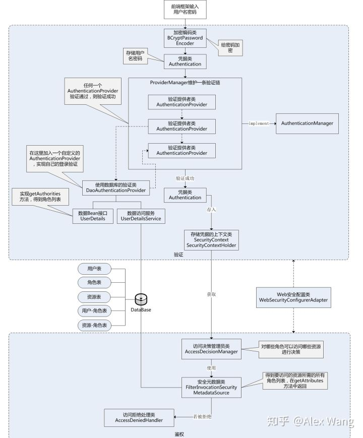
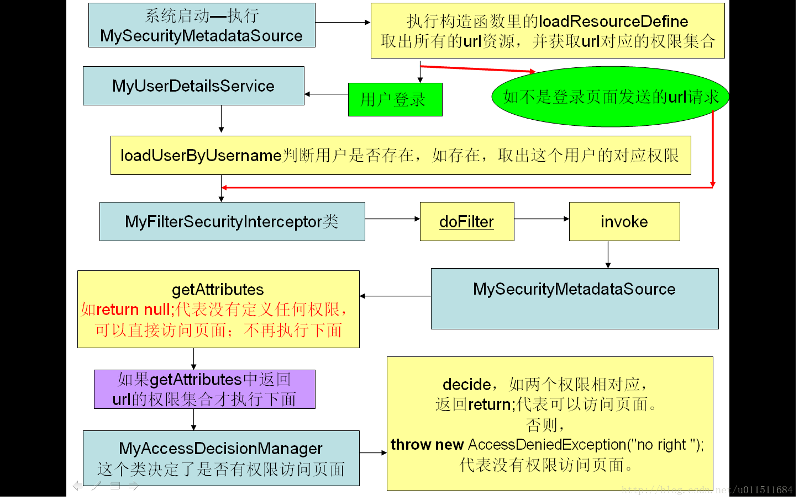

# 结构说明

Spring Security致力于为Java应用提供认证和授权管理。它是一个强大的，高度自定义的认证和访问控制框架。

具体介绍参见https://docs.spring.io/spring-security/site/docs/5.0.5.RELEASE/reference/htmlsingle/

这句话包括两个关键词：Authentication（认证）和 Authorization（授权，也叫访问控制）

认证是验证用户身份的合法性，而授权是控制你可以做什么。

简单地来说，认证就是你是谁，授权就是你可以做什么。

在开始集成之前，我们先简单了解几个接口：

#### AuthenticationProvider

AuthenticationProvider接口是用于认证的，可以通过实现这个接口来定制我们自己的认证逻辑，它的实现类有很多，默认的是JaasAuthenticationProvider

它的全称是 Java Authentication and Authorization Service (JAAS)

#### AccessDecisionManager

AccessDecisionManager是用于访问控制的，它决定用户是否可以访问某个资源，实现这个接口可以定制我们自己的授权逻辑。

#### AccessDecisionVoter

AccessDecisionVoter是投票器，在授权的时通过投票的方式来决定用户是否可以访问，这里涉及到投票规则。

#### UserDetailsService

UserDetailsService是用于加载特定用户信息的，它只有一个接口通过指定的用户名去查询用户。

#### UserDetails

UserDetails代表用户信息，即主体，相当于Shiro中的Subject。User是它的一个实现。

## 执行流程图

