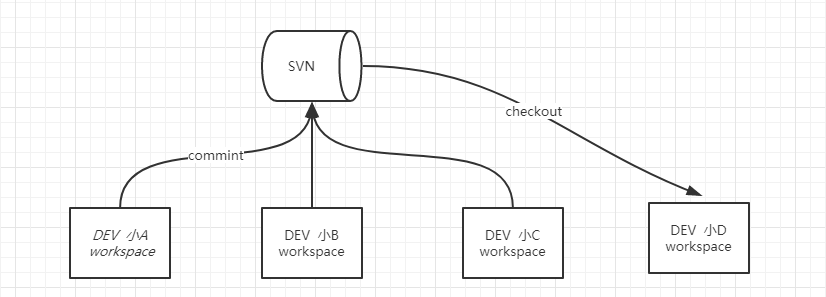
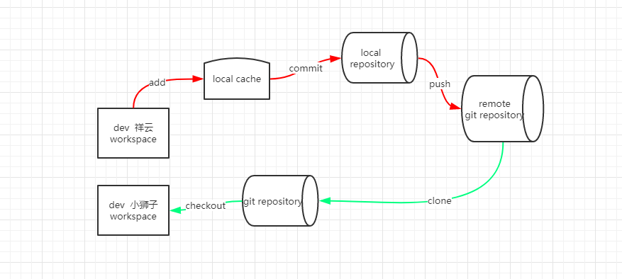
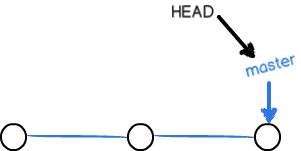
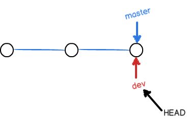
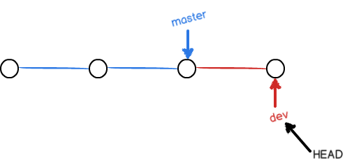
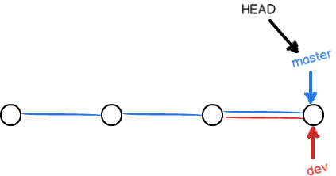
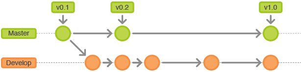
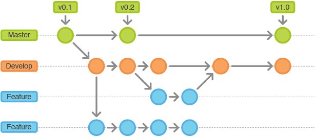
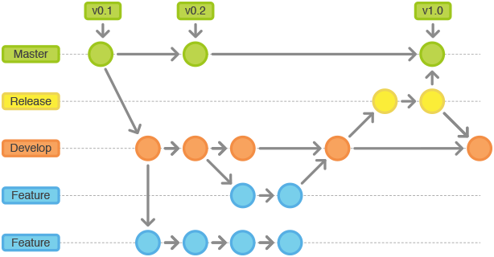

# git概述

## GIT体系概述

### 与SVN区别

SVN 使用流程



主要步骤：

- 提交 、checkout

GIT 使用流程



主要步骤：

- 添加(add) 、提交(commit)、远程推送(push)、远程克隆(clone)、远程更新(pull)

- 其它命令：branch、tag、remote、checkout、merge、log、status 、fetch、rebase等

GIT 与 svn 主要区别：

1. 基于本地进行完整的版本管理，不强依懒远程仓库。

2. GIT把内容按元数据方式存储，而SVN是按文件。

3. GIT分支和SVN的分支不同。

4. GIT是每个历史版本都存储完整的文件,便于恢复,svn是存储差异文件,历史版本不可恢复。(svn恢复是恢复文件，版本依然不变)

### GIT分支说明

一开始的时候，master分支是一条线，Git用master指向最新的提交，再用HEAD指向master，就能确定当前分支，以及当前分支的提交点



当我们创建新的分支，例如dev时，Git新建了一个指针叫dev，指向master相同的提交，再把HEAD指向dev，就表示当前分支在dev上：



你看，Git创建一个分支很快，因为除了增加一个dev指针，改改HEAD的指向，工作区的文件都没有任何变化！

不过，从现在开始，对工作区的修改和提交就是针对dev分支了，比如新提交一次后，dev指针往前移动一步，而master指针不变：



假如我们在dev上的工作完成了，就可以把dev合并到master上。Git怎么合并呢？最简单的方法，就是直接把master指向dev的当前提交，就完成了合并：



## 版本迭代分支管理办法

### 用于记录历史的分支

使用两个分支来记录项目开发的历史，而不是使用单一的master分支。master只是用于保存官方的发布历史，而develop分支才是用于集成各种功能开发的分支。使用版本号为master上的所有提交打标签（tag）也很方便



### 用于功能开发的分支

每一个新功能的开发都应该各自使用独立的分支。为了备份或便于团队之间的合作，这种分支也可以被推送到中央仓库。但是，在创建新的功能开发分支时，父分支应该选择develop（而不是master）。当功能开发完成时，改动的代码应该被合并（merge）到develop分支。功能开发永远不应该直接牵扯到master。



### 用于发布的分支

一旦develop分支积聚了足够多的新功能（或者预定的发布日期临近了），你可以基于develop分支建立一个用于产品发布的分支。这个分支的创建意味着一个发布周期的开始，也意味着本次发布不会再增加新的功能——在这个分支上只能修复bug，做一些文档工作或者跟发布相关的任务。在一切准备就绪的时候，这个分支会被合并入master，并且用版本号打上标签。另外，发布分支上的改动还应该合并入develop分支——在发布周期内，develop分支仍然在被使用（一些开发者会把其他功能集成到develop分支）。使用专门的一个分支来为发布做准备的好处是，在一个团队忙于当前的发布的同时，另一个团队可以继续为接下来的一次发布开发新功能。



### 用于维护的分支

发布后的维护工作或者紧急问题的快速修复也需要使用一个独立的分支。这是唯一一种可以直接基于master创建的分支。一旦问题被修复了，所做的改动应该被合并入master和develop分支（或者用于当前发布的分支）。在这之后，master上还要使用更新的版本号打好标签。


## GIT常用命令讲解

### 本地初始化GIT 仓库

```
#基于远程仓库克隆至本地
git clone <remote_url>

#当前目录初始化为git 本地仓库
git init  <directory>
```

### 日志查看

```
#查看提交历史
git log

#查看命令历史
git reflog
```

### 本地添加

```
#添加指定文件至暂存区
git add <fileName>
#添加指定目录至暂存区
git add <directory>
#添加所有
git add -A
#将指定目录及子目录移除出暂存区
git rm --cached target -r
#添加勿略配置文件 .gitignore
```

### 本地提交

```
#提交至本地仓库
git commit -m '提交评论'
#快捷提交至本地仓库
git commit -Am '快添加与提交'
```

### 本地回滚

```
#回退到某个版本，只回退了commit的信息，不会恢复到index file一级。如果还要提交，直接commit即可
git reset --soft

#彻底回退到某个版本，本地的源码也会变为上一个版本的内容，此命令 慎用！
git reset  --hard

#HEAD 最近一个提交,HEAD^ 上一次提交,HEAD^ ^ 上一次的 上一次的提交（倒数第三次） HEAD~0 最近一个提交,HEAD~1 上一次提交,HEAD^2 上一次的 上一次的提交（倒数第三次）HEAD^2 上一次的 上一次的提交（倒数第三次）
git reset --hard HEAD^

#指定对应的commit id
git reset --hard 1094a
```

### 分支管理

```
#查看当前分支
git branch [-avv]
#基于当前分支新建分支
git branch <branch name>
#基于提交新建分支
git branch <branch name> <commit id>
#切换分支
git checkout <branch name>
#合并分支
git merge <merge target>
#解决冲突，如果因冲突导致自动合并失败，此时 status 为mergeing 状态.
#需要手动修改后重新提交（commit）

#远程分支到本地分支
git checkout -b dev origin/dev
```

### 远程配置

```
#查看远程配置 
git remote [-v]
#添加远程地址
git remote add origin http:xxx.xxx
#删除远程地址
git remote remove origin 
#上传新分支至远程
git branch origin -u 
#将本地分支与远程建立关联
git branch --track --set-upstream-to=origin/test test
```

### tag 管理


```
#查看当前
git tag
#创建分支
git tag <tag name> <branch name>
#删除分支
git tag -d <tag name>
#版本创建tagV20190328
git tag -a V20190328 -m 'version 20190328'
```