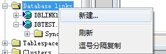
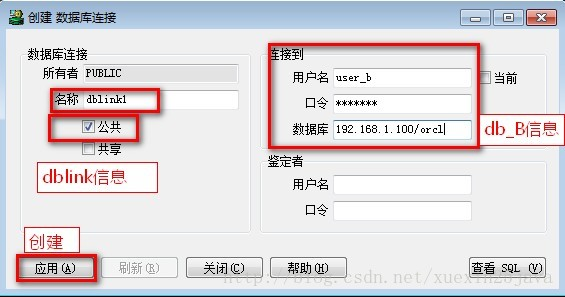

# dbLink

当用户要跨本地数据库，访问另外一个数据库表中的数据时，本地数据库中必须创建了远程数据库的dblink,通过dblink本地数据库可以像访问本地数据库一样访问远程数据库表中的数据。下面讲介绍如何在本地数据库中创建dblink.

## 查看用户是否有创建dblink的权限

以sys用户登录到本地数据库：

```oracle
select * from user_sys_privs t where t.privilege like upper('%link%');
```

结果：

```
1 SYS CREATE DATABASE LINK NO

2 SYS DROP PUBLIC DATABASE LINK NO

3 SYS CREATE PUBLIC DATABASE LINK NO
```

可以看出在数据库中dblink有三种权限CREATE DATABASE LINK(所创建的dblink只能是创建者能使用，别的用户使用不了)，CREATE PUBLIC DATABASE LINK(public表示所创建的dblink所有用户都可以使用)，DROP PUBLIC DATABASE LINK。

在sys用户下，把CREATE PUBLIC DATABASE LINK，DROP PUBLIC DATABASE LINK权限授予给你的用户

```oracle
grant CREATE PUBLIC DATABASE LINK,DROP PUBLIC DATABASE LINK to scott;
```

## 创建DBLink

以用户scott登录本地数据库，创建dblink

```oracle
create public  database link dblink名称    
　　connect to 用户名 identified by 密码
　　using '(DESCRIPTION =(ADDRESS_LIST =(ADDRESS =(PROTOCOL = TCP)(HOST = 192.168.1.100)(PORT = 1521)))(CONNECT_DATA =(SERVICE_NAME = orcl)))'; 
```

## 创建完成，引用

–查询、删除和插入数据和操作本地的数据库是一样的，只不过表名需要写成“表名@dblink服务器”而已。 例:

```oracle
select * from user_bTablename@dblink1 ;  
```

一般情况下引用数据库链接，可以直接将其放到调用的表名或视图名称后面，中间使用一个 @ 作为分割符

## 删除 DBLink

drop  public database link dblink1;  

## 通过tns创建

要求数据库服务器db_A上 tnsnames.ora 中有 数据库db_B的映射 (省略)

```oracle
create database link 数据库链路名 connect to 用户名 identified by 口令 using 'tnsnames.ora配置的主机字符串名';
```

## 通过plsql创建

PLSQL图形配置界面





## 问题

1. 已经给了用户 dblink 的权限，但创建时报权限不足的错。
解决方式：解决：我给用户的是 CREATE PUBLIC DATABASE LINK权限，所以创建时需要create public database link…. 而不能是create database link….
    

