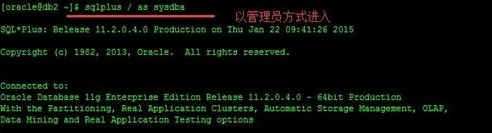
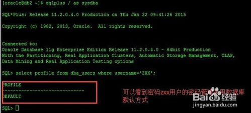
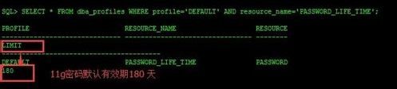

# 数据库密码过期处理

在一段时间以后，oracle用户登陆会提示密码不可用

```
ORA-28001: the password has expired

密码无效
```

oracle默认的用户时间限制是180天以后过期，当提示过期以后，需要修改密码来重置

需要通过sqlplus / as sysdba 方式进去数据库更改



## 查看用户密码默认管理方式

```
SQL> SELECT profile FROM dba_users WHERE username='ZXX';
 
PROFILE
------------------------------
DEFAULT
```



## 查看数据库默认的密码管理方式有效期

```
SQL> SELECT * FROM dba_profiles WHERE profile='DEFAULT' AND resource_name='PASSWORD_LIFE_TIME';
 
PROFILE       RESOURCE_NAME	RESOURCE
------------------------------ -------------------------------- --------
LIMIT
----------------------------------------
DEFAULT       PASSWORD_LIFE_TIME	PASSWORD
180
```



## 修改用户密码并设置数据库默认密码为永久有效

```
SQL> ALTER USER zxx IDENTIFIED BY zxx;
SQL> ALTER PROFILE DEFAULT LIMIT PASSWORD_LIFE_TIME UNLIMITED ;
```

