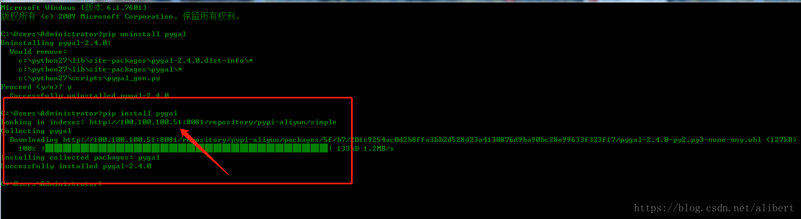

# 本地配置私服地址

## windows

创建文件C:\Users\Administrator\pip\pip.ini

文件内容如下：

```
[global]
index-url = http://192.168.10.220:8089/repository/pypi-public/simple
[install]

trusted-host = 192.168.10.220
```

系统环境变量也加一下C:\Users\Administrator\pip\pip.ini;

看下效果图：



## Linux

在主目录下创建.pip文件夹

```
mkdir ~/.pip
```

用root用户的话，目录是被建在 /root/.pip 是一个隐藏目录，要用ls -la 查看

然后在该目录下创建pip.conf文件编写如下内容：

```
[global]
trusted-host =  192.168.10.220
index-url = http://192.168.10.220:8089/repository/pypi-public/simple
```